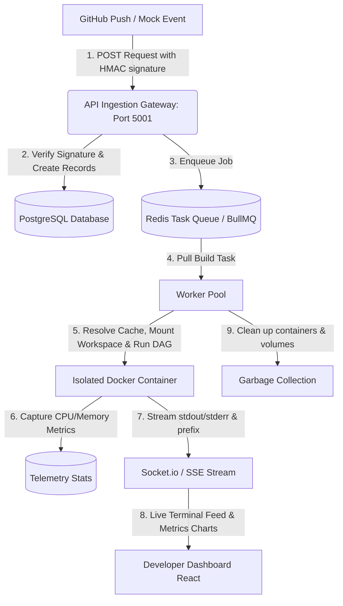

# Git-Triggered Headless CI/CD Automation Engine (MagnusCI)

A premium, high-performance, asynchronous CI/CD orchestration infrastructure designed to simulate the core code ingestion and build pipelines of modern platforms like Vercel, Netlify, and GitHub Actions. This system validates advanced concepts in distributed systems, cryptographic signature verification, background queueing, programmatically managed container sandboxes, live terminal stream multiplexing, resource metrics monitoring, build artifact harvesting, and automatic commit reversion.

---

## The "Shared Book" Analogy

If you have never used cloud build services before, think of MagnusCI as a **Robotic Proofreader** for a book written by a collaborative team:
* **The Push (The Alert)**: A writer saves a draft (code pushed to **GitHub**). A bell rings to alert the assistant (**Our Ingest Gateway**).
* **The Redis Broker (The Queue)**: If multiple writers save at the same time, the assistant places the drafts in a neat, organized line (**Our Redis/BullMQ Queue**) to check them one by one.
* **The Sandbox (Docker Container)**: The assistant takes a copy of the draft into a separate, isolated room (**Our isolated Docker Container**) so they can run checking scripts without messing up the main manuscript or other rooms.
* **The Dependency Caching (The Smart Pantry)**: The assistant remembers the exact list of reference materials needed. If the list hasn't changed, they retrieve them instantly from a local storage box rather than driving to the bookstore, making checks 90% faster.
* **The Live Feed (The Dashboard)**: A dashboard (**Our React Frontend**) displays a pulsing status light and lists spelling mistakes or test reports in real-time.
* **The Auto-Revert (The Undo Action)**: If a writer submits a draft that completely ruins the book, the system automatically marks the draft as failed, logs the exact errors, and reverses the changes to restore the manuscript.

---

## Key Features (Latest Version)

* **Cryptographic Ingestion Gateway**: Exposes a secure, lightning-fast $O(1)$ Express endpoint verifying raw payloads via SHA-256 HMAC signatures (`X-Hub-Signature-256`) in under 30ms.
* **DAG (Directed Acyclic Graph) Pipeline Coordinator**: Parses stage dependency trees inside `magnus-ci.json` (or language fallbacks) to execute compilation, linting, and testing stages concurrently or sequentially while detecting circular dependencies.
* **Lockfile-Hashed Dependency Caching**: Speeds up build executions by hashing lockfiles (`package-lock.json`, `requirements.txt`, `go.sum`, etc.) via SHA-256, mapping hits to localized tarball caches stored on the host.
* **Multi-Language Sandbox Execution**: Programmatically communicates with the host Unix domain socket (`/var/run/docker.sock`) via `dockerode` to spawn isolated, language-specific containers (Node, Python, Go, Maven, Gradle, CMake, Make) with custom volume mounts and 2-minute timeouts.
* **Container Resource Metrics Monitoring**: Periodically polls active Docker containers to track CPU and memory usage, writing aggregate telemetry back to PostgreSQL for real-time visualization.
* **Auto-Revert Commit Engine**: If a build fails, the worker uses the configured `GITHUB_TOKEN` to generate a local Git revert commit containing detailed test failure logs and pushes it back to the remote repository automatically.
* **Live Log Streaming & Multiplexing**: Captures and prefixes concurrent stage logs on the fly, streaming ANSI-stripped and spinner-filtered output logs back to the developer.
* **Build Artifact Harvesting**: Auto-detects, extracts, and exposes compiled binaries (.jar, .war, .zip, .exe, .msi, etc.) and code coverage reports (Jest/pytest htmlcov) in a static public assets folder.
* **GitHub Status API Handshake**: Integrates build tracking updates directly back to GitHub's commit statuses interface (marking commits as pending, success, failure, or error).
* **Premium Developer Dashboard**: React SPA styled with **Tailwind CSS v4** featuring secure GitHub OAuth login, repository connection, live interactive TTY console modal, and container metrics charts.

---

## Technical Architecture & Workflow



---

## Repository Layout

```text
.
├── backend/                       # Express server, Ingestion Gateway, Worker
│   ├── db.sql                     # PostgreSQL schema setup
│   ├── package.json               # Backend dependencies (express, pg, dockerode, bullmq)
│   ├── caches/                    # Persistent caching directory for tarballs
│   │   └── tarballs/
│   ├── temp_builds/               # Auto-generated isolated build workspaces
│   └── src/                       # Backend Source Code
│       ├── index.js               # Entry point of the Express Gateway (Port 5001)
│       ├── db.js                  # PostgreSQL Connection Pool configuration
│       ├── queue.js               # BullMQ (Redis) Queue configuration
│       ├── workspace.js           # Ephemeral workspace directory creators & sweepers
│       ├── worker.js              # Background BullMQ job processor & Docker sandbox executor
│       ├── middleware/
│       │   └── authMiddleware.js  # Secures API endpoints via JWT session validation
│       ├── routes/
│       │   ├── auth.js            # GitHub OAuth routes & JWT token generation
│       │   ├── repositories.js    # Registering & fetching repositories (URL Normalization)
│       │   ├── builds.js          # Fetching historical builds & logs
│       │   └── webhooks.js        # Validating webhook signatures & enqueuing builds
│       └── utils/
│           ├── cache.js           # Lockfile hashing & dependency caching operations
│           ├── dag.js             # Pipeline stages DAG resolution and scheduler
│           └── githubStatus.js    # Integrating commit status updates with GitHub API
│
├── frontend/                      # React SPA Developer Dashboard
│   ├── index.html
│   ├── vite.config.js             # Vite configuration with Tailwind CSS v4 support
│   ├── package.json               # Frontend dependencies (react, tailwindcss)
│   └── src/
│       ├── App.jsx                # Main dashboard UI (OAuth states, repo lists, logs)
│       ├── App.css                # Premium styling custom layouts (Tailwind v4)
│       ├── main.jsx               # React DOM entry point
│       ├── components/
│       │   ├── Header.jsx         # App header with connection indicators
│       │   ├── MetricsRow.jsx     # High-level counters for repos, builds, success rates
│       │   ├── MetricsChart.jsx   # Visualizes CPU and Memory utilization trends
│       │   ├── ConnectRepoCard.jsx# Connect repo form card
│       │   ├── RepoList.jsx       # Selectable list of active projects
│       │   ├── BuildHistory.jsx   # Interactive execution history grid
│       │   └── BuildModal.jsx     # Detailed TTY logging modal and downloader
│       └── utils/
│           └── logParser.js       # Cleans and formats ANSI-escaped terminal logs
│
├── deployment.md                  # Comprehensive Production Deployment & Hardening Guide
│
├── worker/                        # Node.js Worker dependencies directory
│   └── package.json
│
└── reports/                       # Project Documentation & Architecture Guides
    ├── all_about_docker.md        # Containerization basics
    ├── combined_first_principles_report.md # Deep-dive on security, queues, and sockets
    ├── dag_execution_analysis.md  # Step-by-step parallel stage execution proof
    ├── dependency_caching.md      # Lockfile dependency cache architecture
    ├── docker_testing_tutorial.md # Container testing validation guide
    ├── file_structure_explanation.md # Full workspace file breakdown
    ├── github_webhook_testing_guide.md # Local webhook verification guide
    ├── internals.md               # Detailed internal mechanics
    ├── manual_testing_guide.md    # Feature verification guide
    └── project_overview.md        # Big picture workflow summary
```

---

## Getting Started

For a comprehensive guide to deploying MagnusCI in a production-ready environment (using Nginx, PM2, or Docker Compose), refer to the [deployment.md](file:///Users/amankashyap/Documents/ci-cd-engine/deployment.md) guide.

### Prerequisites
* **Node.js** (v20+)
* **PostgreSQL**
* **Redis** (running locally on port `6379`)
* **Docker** (running on host, with Unix socket accessible at `/var/run/docker.sock`)

### 1. Database Setup
Create a PostgreSQL database named `ci_cd_engine` and initialize the schema using `backend/db.sql`:
```bash
createdb ci_cd_engine
psql -d ci_cd_engine -f backend/db.sql
```

### 2. Environment Configuration
Create a `.env` file inside the `backend` directory. Populate it with the required authentication, queue, and GitHub tokens:
```env
PORT=5001
GITHUB_WEBHOOK_SECRET=your_webhook_secret_here
GITHUB_CLIENT_ID=your_github_oauth_client_id
GITHUB_CLIENT_SECRET=your_github_oauth_client_secret
JWT_SECRET=your_jwt_secret_token
FRONTEND_URL=http://localhost:5173
REDIS_HOST=127.0.0.1
REDIS_PORT=6379
GITHUB_TOKEN=your_personal_access_token_with_repo_scope
```
> [!NOTE]
> The `GITHUB_TOKEN` is critical to enable the Status API updates and automated Git Revert Commit functionality on build failures.

### 3. Run the Backend & Worker Daemon
Navigate to the `backend` directory, install dependencies, and start the gateway and worker processor:
```bash
cd backend
npm install
npm run dev
```
*The Express Ingestion Gateway will boot on port `5001`, establish PostgreSQL pool links, and instantiate the BullMQ Worker loop.*

### 4. Run the Developer Dashboard
Navigate to the `frontend` directory, install package dependencies, and run Vite:
```bash
cd frontend
npm install
npm run dev
```
*Vite serves the UI locally (usually on [http://localhost:5173](http://localhost:5173)).*

---

## Advanced Pipeline Customization (magnus-ci.json)

To orchestrate complex workflows, you can place a `magnus-ci.json` configuration file at the root of your target repository:

```json
{
  "language": "Node.js",
  "image": "node:20-alpine",
  "stages": {
    "setup": {
      "run": "npm install"
    },
    "lint": {
      "run": "npm run lint",
      "needs": ["setup"]
    },
    "test": {
      "run": "npm test",
      "needs": ["setup"]
    },
    "compile": {
      "run": "npm run build",
      "needs": ["lint", "test"]
    }
  }
}
```
* **Language Fallbacks**: If no configuration is present, the engine auto-detects toolchains (Node.js, Go, Python, Maven, Gradle, CMake, Make) and applies optimized baseline execution presets.
* **Dependencies (needs)**: Defines graph nodes. In the configuration above, `lint` and `test` run in parallel once `setup` finishes. `compile` executes only after both quality checks pass.

---

## Verification & Testing

### Manual Dashboard Audits
1. Open http://localhost:5173.
2. Authenticate using GitHub OAuth.
3. Register your repository URL (URLs are normalized automatically).
4. Watch build processes execute:
   * **Telemetry**: View real-time container CPU and Memory metrics charts.
   * **Console Modal**: Stream live terminal outputs prefixed by active stages (e.g. `[SETUP]`, `[TEST]`).
   * **Reverts**: Verify that pushing a broken test commit triggers an automated `[REVERT]` routine that reverts the commit on your branch.
   * **Artifacts**: Download harvested binaries or browse HTML test coverage outputs.
