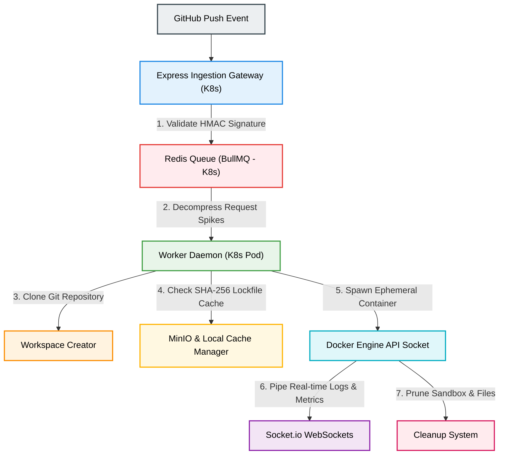

<!-- PROJECT SHIELDS -->
[![Contributors][contributors-shield]][contributors-url]
[![Forks][forks-shield]][forks-url]
[![Stargazers][stars-shield]][stars-url]
[![Issues][issues-shield]][issues-url]
[![MIT License][license-shield]][license-url]

<div align="center">

<h3 align="center">MagnusCI</h3>

  <p align="center">
    An Ephemeral Container-Based CI/CD Orchestration Engine
    <br />
    <a href="https://github.com/AmanKashyapp07/ci-cd-engine"><strong>Explore the docs</strong></a>
    <br />
    <br />
    <a href="http://magnus-ci.online">View Live Demo</a>
    ·
    <a href="https://github.com/AmanKashyapp07/ci-cd-engine/issues">Report Bug</a>
    ·
    <a href="https://github.com/AmanKashyapp07/ci-cd-engine/issues">Request Feature</a>
  </p>
</div>

<!-- TABLE OF CONTENTS -->
<details>
  <summary>Table of Contents</summary>
  <ol>
    <li>
      <a href="#about-the-project">About The Project</a>
      <ul>
        <li><a href="#built-with">Built With</a></li>
      </ul>
    </li>
    <li>
      <a href="#key-features">Key Features</a>
    </li>
    <li>
      <a href="#getting-started">Getting Started</a>
      <ul>
        <li><a href="#prerequisites">Prerequisites</a></li>
        <li><a href="#installation">Installation</a></li>
      </ul>
    </li>
    <li><a href="#usage">Usage</a></li>
    <li><a href="#testing--automated-quality-verification">Testing & Automated Quality Verification</a></li>
    <li><a href="#system-workflow">System Workflow</a></li>
    <li><a href="#production-deployment-kubernetes--k3s">Production Deployment (Kubernetes / K3s)</a></li>
    <li><a href="#future-scaling-scope--kubernetes-roadmap">Future Scaling Scope & Kubernetes Roadmap</a></li>
    <li><a href="#challenges-faced--learning-outcomes">Challenges Faced & Learning Outcomes</a></li>
    <li><a href="#license">License</a></li>
    <li><a href="#contact">Contact</a></li>
  </ol>
</details>

<!-- ABOUT THE PROJECT -->
## About The Project

MagnusCI is a custom-built, lightweight CI/CD orchestration engine designed to demonstrate the underlying mechanics of modern automation platforms like GitHub Actions and Vercel. 

Instead of relying on pre-existing CI tools, this project implements the core execution pipeline from scratch. The system intercepts code pushes via GitHub webhooks, manages execution pipelines using a custom Directed Acyclic Graph (DAG) scheduler, runs build stages within isolated ephemeral Docker containers, and streams real-time terminal output and resource telemetry to a web-based React monitoring dashboard. The production system is containerized and deployed natively on Kubernetes (K3s) at http://magnus-ci.online.

### Built With

* [![Kubernetes][Kubernetes.io]][Kubernetes-url]
* [![Docker][Docker.com]][Docker-url]
* [![React][React.js]][React-url]
* [![TailwindCSS][Tailwind.css]][Tailwind-url]
* [![Express][Express.js]][Express-url]
* [![NodeJS][Node.js]][Node-url]
* [![Postgres][Postgres.sql]][Postgres-url]
* [![Redis][Redis.io]][Redis-url]
* [![Playwright][Playwright.dev]][Playwright-url]


<!-- KEY FEATURES -->
## Key Features

* **Kubernetes (K3s) Cluster Orchestration:** Containerized multi-pod deployment running on Kubernetes (K3s) with scaled API gateways, background worker daemon, PostgreSQL, Redis event broker, and MinIO S3 storage.
* **Cryptographic Webhook Validation:** Secures ingestion gateway endpoints by verifying incoming GitHub webhook payloads using SHA-256 HMAC signatures.
* **Asynchronous Task Queue:** Decouples API ingestion from resource-heavy build execution runners using BullMQ and Redis to manage system backpressure.
* **Host-Isolated Container Execution:** Spawns ephemeral Docker containers directly through the Docker Engine socket (`/var/run/docker.sock`) and shared host paths (`/tmp/magnus-builds`) to guarantee safe build environments.
* **DAG Execution Engine:** Parses stage dependencies defined in a custom `magnus-ci.json` configuration and executes independent steps concurrently.
* **SHA-256 Dependency Caching:** Hashes package lockfiles and caches compression directories in local tarball archives and MinIO S3 object storage.
* **Real-Time Logs & Telemetry:** Establishes duplex WebSocket connections via Socket.io to pipe container output streams and resource metrics to the UI.
* **GitHub Commit Status Feedback:** Integrates with the GitHub Statuses API to update commit verification badges on the remote repository.
* **Automated Revert Recovery & Infinite Loop Guard:** Detects build failures on main branches to trigger reverts, while automatically suppressing recursion for commits authored by `Magnus CI`.
* **Unified Master Test Orchestrator (`test.sh`):** Single-command test runner executing 6 comprehensive test suites covering Unit, Integration, Live Backend, Kubernetes Infrastructure, Playwright Browser E2E, and Local Repository Pipelines.


<!-- GETTING STARTED -->
## Getting Started

To get a local copy up and running, follow these simple steps.

### Prerequisites

* **Node.js** (v20 or higher)
* **PostgreSQL** (running on port `5432`)
* **Redis** (running locally on port `6379`)
* **Docker** (running on host, with socket accessible at `/var/run/docker.sock`)
* **Kubernetes (k3s / kubectl)** (optional for full K8s deployment)

### Installation

1. Clone the repo:
   ```bash
   git clone https://github.com/AmanKashyapp07/ci-cd-engine.git
   cd ci-cd-engine
   ```
2. Initialize the PostgreSQL schema:
   ```bash
   psql -U amankashyap -d ci_cd_engine -f backend/db.sql
   ```
3. Configure your Environment variables. Create a `.env` file inside the `backend/` directory:
   ```env
   PORT=5001
   GITHUB_WEBHOOK_SECRET=your_webhook_secret_here
   GITHUB_CLIENT_ID=your_github_oauth_client_id
   GITHUB_CLIENT_SECRET=your_github_oauth_client_secret
   JWT_SECRET=your_jwt_secret_token
   FRONTEND_URL=http://localhost:5173
   REDIS_HOST=127.0.0.1
   REDIS_PORT=6379
   GITHUB_TOKEN=your_personal_access_token
   ```
4. Install npm packages for sub-projects and testing:
   ```bash
   # Install Backend dependencies
   cd backend && npm install
   
   # Install Frontend dependencies
   cd ../frontend && npm install

   # Install Testing dependencies
   cd ../testing && npm install
   ```


<!-- USAGE EXAMPLES -->
## Usage

### Running Locally

To run the application locally, start the following services:

**Terminal 1: Start the Background Worker Daemon**
```bash
cd backend
node src/worker.js
```

**Terminal 2: Start the Express Gateway Server**
```bash
cd backend
npm run dev
```

**Terminal 3: Start the Vite Frontend Development Server**
```bash
cd frontend
npm run dev
```
Open `http://localhost:5173` in your browser to access the dashboard.

### Configuring Target Repositories (`magnus-ci.json`)

To configure builds, create a `magnus-ci.json` file in the root of your target repositories:
```json
{
  "language": "Node.js",
  "image": "node:20-alpine",
  "stages": {
    "setup": { "run": "npm ci" },
    "lint": { "run": "npm run lint", "needs": ["setup"] },
    "test": { "run": "npm test", "needs": ["setup"] },
    "compile": { "run": "npm run build", "needs": ["lint", "test"] }
  }
}
```


<!-- TESTING & AUTOMATED QUALITY VERIFICATION -->
## Testing & Automated Quality Verification

MagnusCI includes a production-grade master test runner `test.sh` that validates the full system end-to-end across 6 distinct test suites:

```bash
./test.sh
```

```text
========================================================================
               MASTER TEST EXECUTION SUMMARY                            
========================================================================
 All 6/6 Test Suites Passed Successfully!
 Production Target: http://magnus-ci.online
========================================================================
```

### Suite Breakdown:
1. **Unit Test Suite (Jest - 42 tests):** DAG cycle detection algorithms, topological execution order, log stream parsing, dependency fingerprinting, MinIO S3 storage, and Socket.io Redis adapter.
2. **Integration Test Suite (Jest + Supertest - 9 tests):** SHA-256 HMAC webhook signature verification, JWT Bearer token authentication, and OAuth entrypoint redirects.
3. **Live E2E Backend Deployment Suite (10 tests):** Real-time HTTP/CORS header checks against `http://magnus-ci.online`, static JS/CSS asset delivery, unhandled route isolation, and webhook circuit breaker tests.
4. **Kubernetes Infrastructure Test Suite (4 tests):** Directly tests the live K3s Kubernetes cluster, checking Node readiness, Pod phase (`Running 1/1`), container volume mounts (`docker-socket`, `temp-builds`), and service endpoints.
5. **Playwright Browser E2E Suite (Chromium - 14 tests):** Fully automated browser testing verifying unauthenticated landing page components, mobile responsiveness (375x667), authenticated dashboard metrics, workspace lists, and build log modal terminals.
6. **Local Repository Pipeline Suite:** Disk layout verification, `magnus-ci.json` DAG validation, and execution of local unit test runners in `/Users/amankashyap/Documents/tes`.


<!-- SYSTEM WORKFLOW -->
## System Workflow


```mermaid
graph TD
    %% Nodes
    A["GitHub Push Event"]
    B["Express Ingestion Gateway (K8s)"]
    C["Redis Queue (BullMQ - K8s)"]
    D["Worker Daemon (K8s Pod)"]
    E["Workspace Creator"]
    F["MinIO & Local Cache Manager"]
    G["Docker Engine API Socket"]
    H["Socket.io WebSockets"]
    I["Cleanup System"]

    %% Connections
    A --> B
    B -->|1. Validate HMAC Signature| C
    C -->|2. Decompress Request Spikes| D
    D -->|3. Clone Git Repository| E
    D -->|4. Check SHA-256 Lockfile Cache| F
    D -->|5. Spawn Ephemeral Container| G
    G -->|6. Pipe Real-time Logs & Metrics| H
    G -->|7. Prune Sandbox & Files| I

    %% Styling
    style A fill:#ECEFF1,stroke:#37474F,stroke-width:2px,color:#000
    style B fill:#E3F2FD,stroke:#1E88E5,stroke-width:2px,color:#000
    style C fill:#FFEBEE,stroke:#E53935,stroke-width:2px,color:#000
    style D fill:#E8F5E9,stroke:#43A047,stroke-width:2px,color:#000
    style E fill:#FFF3E0,stroke:#FB8C00,stroke-width:2px,color:#000
    style F fill:#FFF8E1,stroke:#FFB300,stroke-width:2px,color:#000
    style G fill:#E0F7FA,stroke:#00ACC1,stroke-width:2px,color:#000
    style H fill:#F3E5F5,stroke:#8E24AA,stroke-width:2px,color:#000
    style I fill:#FFEBEE,stroke:#D81B60,stroke-width:2px,color:#000
```


<!-- PRODUCTION DEPLOYMENT -->
## Production Deployment (Kubernetes / K3s)

This project is fully deployed on a production Azure Virtual Machine running a Kubernetes (K3s) cluster under the domain http://magnus-ci.online. All Kubernetes manifests are version-controlled in the `k8s/` directory:

```bash
# Apply Kubernetes Workloads
sudo k3s kubectl apply -f k8s/postgres.yaml
sudo k3s kubectl apply -f k8s/redis.yaml
sudo k3s kubectl apply -f k8s/minio.yaml
sudo k3s kubectl apply -f k8s/magnus-api.yaml
sudo k3s kubectl apply -f k8s/magnus-worker.yaml
```

### Kubernetes Architecture Topology:
1. **Scaled API Gateway (`magnus-api`):** Deployed as a multi-pod Kubernetes `Deployment` serving the Vite SPA static bundle and proxying API/WebSocket traffic.
2. **Background Queue Daemon (`magnus-worker`):** Runs as a Kubernetes pod mounted with `/var/run/docker.sock` and `/tmp/magnus-builds` (`hostPath`) to spawn sibling container build sandboxes.
3. **Database & Broker Layer:** PostgreSQL, Redis (with Socket.io Redis Adapter), and MinIO S3 Object Storage run as containerized Kubernetes workloads.


<!-- FUTURE ROADMAP -->
## Future Scaling Scope & Kubernetes Roadmap

To scale MagnusCI to handle 10,000+ builds per day for enterprise workloads:

1. **Stateless Gateway Auto-Scaling:** Deploy API gateways with a Horizontal Pod Autoscaler (HPA) and Nginx Ingress Controller with cert-manager for automated Let's Encrypt TLS certificates.
2. **Serverless Ephemeral Job Runners:** Refactor worker daemon to invoke the Kubernetes API Server via `@kubernetes/client-node`. Each build stage spawns as a short-lived Kubernetes Job Pod, leveraging automatic pod lifecycle cleanup (`ttlSecondsAfterFinished`).
3. **Daemonless Container Isolation (Kaniko / Rootless Podman):** Execute container image builds securely inside Kubernetes Jobs using Kaniko or Rootless Podman, removing root Docker daemon socket vulnerabilities.


<!-- CHALLENGES AND LEARNINGS -->
## Challenges Faced & Learning Outcomes

* **Kubernetes Docker-out-of-Docker Path Resolution:** When running `magnus-worker` inside a Kubernetes pod, spawning sibling containers via `/var/run/docker.sock` initially failed to locate cloned workspace files. We resolved this by mounting a shared `hostPath` volume (`/tmp/magnus-builds`) and configuring `HOST_WORKSPACE_PATH` so both pod and host Docker daemon share exact file paths.
* **Alpine Git Dependency Ingestion:** Added `git` binary installation to Stage 2 of `backend/Dockerfile` (`apk add --no-cache git`), enabling repository cloning and checkout routines inside minimal Node-alpine container runtimes.
* **HMAC Request Ingress Verification:** express.js automatically parses incoming request streams, stripping HTTP headers and mutating body buffers. We resolved this by modifying JSON parser configurations to capture and store the unparsed request buffer as `rawBody`.
* **Circular Graph Validation:** User-defined build sequences inside `magnus-ci.json` introduce the risk of infinite loops. We implemented a Depth-First Search (DFS) cycle-checking algorithm to audit pipeline DAGs before execution.


<!-- LICENSE -->
## License

Distributed under the MIT License. See `LICENSE` for more information.


<!-- CONTACT -->
## Contributor

Aman Kashyap - [@AmanKashyapp07](https://github.com/AmanKashyapp07) 


<!-- MARKDOWN LINKS & IMAGES -->
[contributors-shield]: https://img.shields.io/github/contributors/AmanKashyapp07/ci-cd-engine.svg?style=for-the-badge
[contributors-url]: https://github.com/AmanKashyapp07/ci-cd-engine/graphs/contributors
[forks-shield]: https://img.shields.io/github/forks/AmanKashyapp07/ci-cd-engine.svg?style=for-the-badge
[forks-url]: https://github.com/AmanKashyapp07/ci-cd-engine/network/members
[stars-shield]: https://img.shields.io/github/stars/AmanKashyapp07/ci-cd-engine.svg?style=for-the-badge
[stars-url]: https://github.com/AmanKashyapp07/ci-cd-engine/stargazers
[issues-shield]: https://img.shields.io/github/issues/AmanKashyapp07/ci-cd-engine.svg?style=for-the-badge
[issues-url]: https://github.com/AmanKashyapp07/ci-cd-engine/issues
[license-shield]: https://img.shields.io/github/license/AmanKashyapp07/ci-cd-engine.svg?style=for-the-badge
[license-url]: https://github.com/AmanKashyapp07/ci-cd-engine/blob/main/LICENSE
[Kubernetes.io]: https://img.shields.io/badge/Kubernetes-326CE5?style=for-the-badge&logo=kubernetes&logoColor=white
[Kubernetes-url]: https://kubernetes.io/
[Docker.com]: https://img.shields.io/badge/Docker-2496ED?style=for-the-badge&logo=docker&logoColor=white
[Docker-url]: https://www.docker.com/
[React.js]: https://img.shields.io/badge/React-20232A?style=for-the-badge&logo=react&logoColor=61DAFB
[React-url]: https://reactjs.org/
[Tailwind.css]: https://img.shields.io/badge/Tailwind_CSS-38B2AC?style=for-the-badge&logo=tailwind-css&logoColor=white
[Tailwind-url]: https://tailwindcss.com/
[Express.js]: https://img.shields.io/badge/Express.js-000000?style=for-the-badge&logo=express&logoColor=white
[Express-url]: https://expressjs.com/
[Node.js]: https://img.shields.io/badge/Node.js-339933?style=for-the-badge&logo=nodedotjs&logoColor=white
[Node-url]: https://nodejs.org/
[Postgres.sql]: https://img.shields.io/badge/PostgreSQL-316192?style=for-the-badge&logo=postgresql&logoColor=white
[Postgres-url]: https://www.postgresql.org/
[Redis.io]: https://img.shields.io/badge/Redis-DC382D?style=for-the-badge&logo=redis&logoColor=white
[Redis-url]: https://redis.io/
[Playwright.dev]: https://img.shields.io/badge/Playwright-2EAD33?style=for-the-badge&logo=playwright&logoColor=white
[Playwright-url]: https://playwright.dev/
