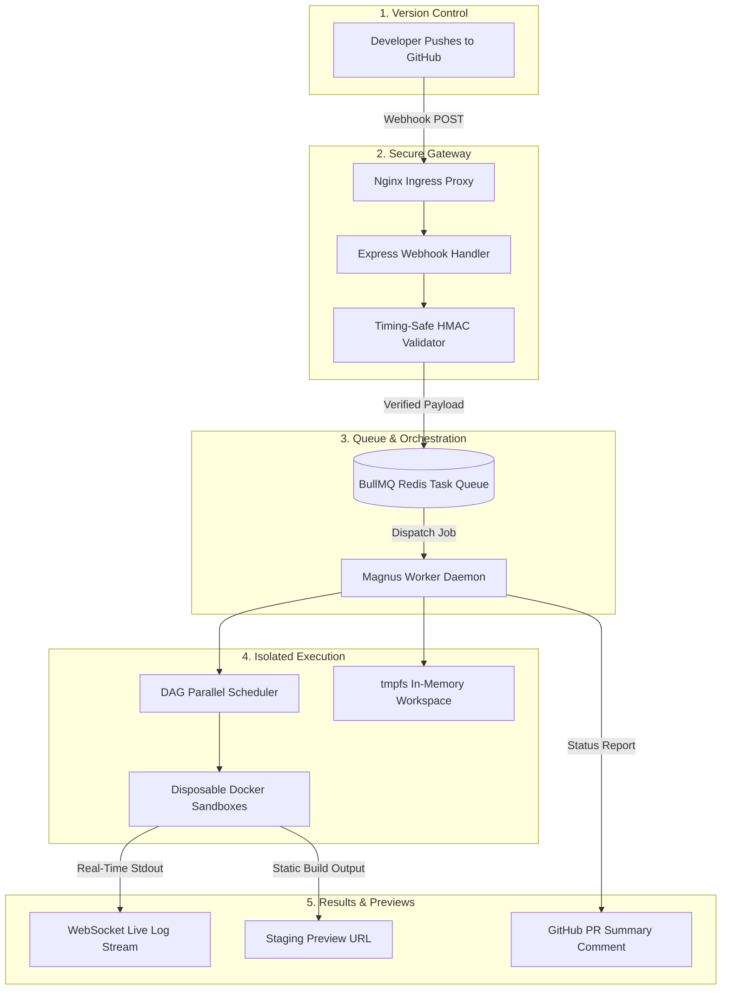

<div align="center">

# MagnusCI

### Ephemeral Container-Native CI/CD Automation Platform

**Automated Testing** • **Parallel DAG Pipelines** • **Live Terminal Streaming** • **Instant Staging Previews** • **Kubernetes Orchestrated**

[View Repository](https://github.com/AmanKashyapp07/ci-cd-engine) · [Live Production](http://129.154.39.198/ci/) · [Report Issue](https://github.com/AmanKashyapp07/ci-cd-engine/issues)

---

</div>

**MagnusCI** is an automated continuous integration and delivery (CI/CD) platform designed from the ground up for containerized workloads. Think of it as a lightweight, self-hosted alternative to **GitHub Actions** or **GitLab CI** that automatically builds code, runs tests in parallel, streams terminal logs in real time, and deploys live web preview environments whenever code is pushed.

When a developer opens a Pull Request or pushes code to GitHub, MagnusCI automatically verifies the webhook, spins up fresh disposable Linux containers in high-speed RAM, executes pipeline stages concurrently, and comments back on the Pull Request with an interactive status report and live staging preview link.

---

## Why I Built This

Modern development teams rely heavily on CI/CD pipelines, but traditional setups frequently suffer from four major pain points:
- **Slow, Serialized Build Queues:** Running build and test steps one-by-one keeps developers waiting and slows down shipping velocity.
- **Dirty Build Runners & Host Disk Fill-Up:** Old build artifacts, unpruned Docker images, and residual files accumulate on runner machines, eventually exhausting disk space.
- **Blind Pull Request Reviews:** Reviewing frontend changes often requires pulling branches locally and running dev servers just to see how the UI looks.
- **Complex, Expensive Tooling:** Commercial CI/CD platforms can be costly for growing teams and difficult to self-host or customize.

I built MagnusCI to solve these challenges with a clean, container-native architecture: parallel execution graphs, disposable in-memory sandboxes, automated preview deployments, and low-latency log streaming.

---

## Table of Contents

- [Key Features at a Glance](#key-features-at-a-glance)
- [How It Works (At a Glance)](#how-it-works-at-a-glance)
- [Deep-Dive Engineering Highlights](#deep-dive-engineering-highlights-for-technical-interviewers)
- [Tech Stack](#tech-stack)
- [Live Environment & Deployment](#live-environment--deployment)
- [Getting Started (Local Development)](#getting-started-local-development)
- [Testing & Quality Assurance](#testing--quality-assurance)
- [Future Roadmap](#future-roadmap)
- [License](#license)

---

## Key Features at a Glance

### 1. Smart Parallel Pipeline Scheduling (DAG Engine)
Pipelines are configured in a simple `magnus-ci.json` file. The scheduling engine resolves stage prerequisites dynamically, launching independent build, lint, and test jobs in parallel to finish pipelines in a fraction of the time required by sequential runners.

### 2. Ephemeral In-Memory Container Sandboxes
Every build stage executes inside an isolated Docker container mounted onto Linux kernel RAM (`tmpfs` / `/dev/shm`). This accelerates test execution by eliminating physical disk I/O and ensures containers leave zero leftover files on the host machine upon completion.

### 3. Real-Time Terminal Log Streaming
Watch build outputs, compilation warnings, and test results stream live into your browser via WebSockets. The built-in terminal viewer features ANSI color decoding, log filtering, and auto-scrolling.

### 4. Instant Live PR Staging Previews
Whenever a frontend build completes, MagnusCI automatically packages web assets (`dist/`, `build/`) and hosts them on a temporary staging URL (`/preview/:buildId/`). Reviewers can test responsive designs and UI changes directly in their browser before merging.

### 5. High-Speed Dependency Caching (MinIO S3)
Computes deterministic SHA-256 fingerprints across project lockfiles (`package-lock.json`, `requirements.txt`, `go.sum`). Caches dependency folders in MinIO S3 using multi-threaded Zstandard compression, cutting installation times on repeat builds.

### 6. Automated GitHub Pull Request Bot
A built-in PR bot formats and posts markdown summaries directly to GitHub Pull Requests, providing reviewers with immediate status indicators, stage runtimes, error tracebacks, and clickable preview links.

### 7. Self-Healing Auto-Revert with Loop Prevention
If a bad commit slips into the main production branch and breaks tests, MagnusCI can automatically generate a revert pull request to protect production stability. Built-in commit signature detection prevents infinite CI webhook loops.

---

## How It Works (At a Glance)

MagnusCI automates the path from a Git push to verified code and live previews in five steps:


```mermaid
flowchart TD
    subgraph Git ["1. Version Control"]
        Push["Developer Pushes to GitHub"]
    end

    subgraph Ingress ["2. Secure Gateway"]
        Nginx["Nginx Ingress Proxy"]
        Express["Express Webhook Handler"]
        HMAC["Timing-Safe HMAC Validator"]
    end

    subgraph Queue ["3. Queue & Orchestration"]
        BullMQ[("BullMQ Redis Task Queue")]
        Worker["Magnus Worker Daemon"]
    end

    subgraph Execution ["4. Isolated Execution"]
        DAG["DAG Parallel Scheduler"]
        RAMDisk["tmpfs In-Memory Workspace"]
        Docker["Disposable Docker Sandboxes"]
    end

    subgraph Outputs ["5. Results & Previews"]
        LiveLogs["WebSocket Live Log Stream"]
        Previews["Staging Preview URL"]
        PRBot["GitHub PR Summary Comment"]
    end

    Push -->|Webhook POST| Nginx
    Nginx --> Express
    Express --> HMAC
    HMAC -->|Verified Payload| BullMQ
    BullMQ -->|Dispatch Job| Worker

    Worker --> RAMDisk
    Worker --> DAG
    DAG --> Docker

    Docker -->|Real-Time Stdout| LiveLogs
    Docker -->|Static Build Output| Previews
    Worker -->|Status Report| PRBot
```

1. **Trigger:** A developer pushes code or opens a PR on GitHub.
2. **Verify:** The API Gateway validates GitHub's cryptographic HMAC-SHA256 signature against the raw request body to reject unauthorized requests.
3. **Queue:** The build task enters a Redis-backed BullMQ priority queue, ensuring request spikes are absorbed smoothly without overwhelming the workers.
4. **Execute:** The worker daemon allocates an ephemeral RAM workspace, determines stage readiness using the DAG scheduler, and runs tasks inside secure Docker sandboxes.
5. **Deliver:** Build logs stream live to connected developers, static previews are deployed instantly, and a summary comment is posted to GitHub.

---

## Deep-Dive Engineering Highlights (For Technical Interviewers)

For engineering interviewers and systems reviewers, this section details the underlying algorithms, reliability models, and sandboxing architecture.

<details>
<summary><b>1. DAG Scheduling: DFS Cycle Detection & Dynamic Readiness Frontier (<code>dag.js</code>)</b></summary>
<br/>

* **Cycle Detection with Depth-First Search:** Before executing any container, `hasCycle()` traverses stage dependencies using recursive DFS with active recursion-stack tracking (`visited` and `recStack` sets). Circular definitions (e.g., A depends on B, B depends on A) are rejected in $O(V+E)$ time with descriptive error diagnostics before consuming compute resources.
* **Dynamic Parallel Readiness Frontier:** Rather than using a static topological queue (like Kahn's algorithm) that enforces artificial layer barriers, `executeDAG()` evaluates a dynamic readiness frontier. As stages execute asynchronously, newly unblocked stages whose prerequisites have all reached `SUCCESS` are immediately dispatched concurrently via `Promise.race()`. This maximizes parallelism across stages with unpredictable, variable runtimes.
* **Failure Halting:** If an upstream stage exits with a non-zero code, all downstream dependents remain `PENDING` while independent branches continue executing to completion.
</details>

<details>
<summary><b>2. In-Memory Workspace Allocation (<code>workspaceAllocator.js</code>)</b></summary>
<br/>

* **Kernel RAM-Disk Workspaces:** Builds are provisioned directly in Linux kernel memory (`/dev/shm/magnus-builds/workspace-${buildId}`). This eliminates physical SSD read/write cycles and accelerates compilation and test suites significantly.
* **Automatic Fallback:** If RAM headroom is insufficient, the allocator automatically falls back to host disk storage (`/tmp/magnus-builds`).
* **Atomic Purge & Host Maintenance:** Upon build completion, workspace folders are recursively purged. A companion maintenance script (`cleanup.sh`) scheduled via cron reclaims host Docker cache layers and expired staging preview folders.
</details>

<details>
<summary><b>3. Zstandard (zstd) Multi-Threaded Compression for S3 Caching (<code>zstdCache.js</code>)</b></summary>
<br/>

* **Multi-Core Parallelism:** Replaces single-threaded gzip with native multi-core `zstd -T0 -3` streaming compression, generating `.tar.zst` dependency archives with automated fallback to `.tar.gz`.
* **High-Throughput Hydration:** Provides significantly higher decompression throughput than gzip, drastically reducing cache download and extraction times from MinIO S3 object storage.
* **Deterministic Fingerprinting:** Computes SHA-256 fingerprints across project dependency lockfiles (`package-lock.json`, `requirements.txt`, `go.sum`) so identical dependency sets never rebuild from scratch.
</details>

<details>
<summary><b>4. Queue Decoupling & Concurrency Controls with BullMQ (<code>queue.js</code> & <code>worker.js</code>)</b></summary>
<br/>

* **Asynchronous Decoupling:** Separates HTTP webhook reception from compute-heavy container execution. The webhook receiver returns an immediate `202 Accepted` response within milliseconds while BullMQ manages worker dispatch.
* **Failure Resilience:** Stalled worker jobs are automatically detected and reclaimed via Redis heartbeat leases. If a worker pod crashes mid-build, the job transitions cleanly and orphaned containers are reaped.
* **Database Connection Guardrails:** PostgreSQL pool sizing is tuned with statement timeouts and indexed B-Tree lookups on `builds`, `build_logs`, and `webhook_events` to protect against connection exhaustion under burst traffic.
</details>

<details>
<summary><b>5. Container Sandboxing & Security Boundaries</b></summary>
<br/>

* **Docker Socket Architecture:** The host `/var/run/docker.sock` is mounted exclusively to the trusted backend worker daemon pod to manage container lifecycles. User build containers are strictly prohibited from mounting the socket.
* **Threat Model Consideration:** Because mounting `docker.sock` grants the worker daemon root-equivalent host capabilities, build containers execute under non-root user accounts with dropped Linux capabilities and strict cgroup boundaries (RAM caps, CPU throttles, and PID limits to stop fork bombs). Future architectural milestones target rootless builders (Kaniko / Sysbox) or ephemeral Kubernetes Jobs.
* **Filesystem & Secret Safety:** Build workspaces are isolated to temporary paths to prevent path traversal attempts (`../../etc/passwd`), and sensitive server environment secrets are stripped before passing environment variables into build containers.
</details>

---

## Tech Stack

| Layer | Technologies |
| :--- | :--- |
| **Frontend UI** | React 19, Tailwind CSS, Vite, Lucide Icons, xterm-compatible log parser |
| **Gateway & Webhooks** | Node.js, Express, Timing-Safe HMAC-SHA256 (`crypto.timingSafeEqual`) |
| **Task Queue & Event Mesh** | BullMQ, Redis 7 (Pub/Sub & Socket.io adapter) |
| **Scheduler Engine** | Custom DAG Engine (`dag.js`) with DFS cycle detection and parallel frontier |
| **Container Sandboxing** | Docker Engine API (`dockerode`), `tmpfs` RAM disk (`/dev/shm`), cgroups |
| **Artifact & Cache Storage** | MinIO (S3-compatible Object Storage), Zstandard (`zstd -T0`), PostgreSQL 16 |
| **Orchestration & Deploy** | Kubernetes (K3s), Nginx Ingress, automated deploy scripts |
| **Testing** | Jest (unit & integration), Playwright (browser E2E) |

---

## Live Environment & Deployment

MagnusCI is deployed and running live on an Oracle Cloud VM orchestrated via Kubernetes (K3s):

**Live URL:** [http://129.154.39.198/ci/](http://129.154.39.198/ci/)

- **Reverse Proxy:** Nginx routes API traffic, serves static frontend assets, and handles WebSocket room upgrades.
- **Microservice Namespaces:** API Gateway, BullMQ Worker Pool, PostgreSQL, Redis, and MinIO run in dedicated K3s pods with automated rolling deployments.
- **Staging Previews:** Build outputs are isolated and served under `/preview/:buildId/` with automated TTL cleanup.

---

## Getting Started (Local Development)

### Prerequisites
- **Node.js**: v18 or higher
- **Docker Engine**: Installed and running locally
- **PostgreSQL**: v16 or higher
- **Redis**: v7 or higher

### Quick Setup

```bash
# 1. Clone the repository
git clone https://github.com/AmanKashyapp07/ci-cd-engine.git
cd ci-cd-engine

# 2. Setup PostgreSQL database
createdb ci_cd_engine
psql -d ci_cd_engine -f backend/db.sql

# 3. Install backend and frontend dependencies
cd backend && npm install
cd ../frontend && npm install
cd ..

# 4. Configure environment variables in backend/.env
# PORT=5001
# POSTGRES_DB=ci_cd_engine
# REDIS_HOST=127.0.0.1
# GITHUB_WEBHOOK_SECRET=your_secret

# 5. Launch development services
# Terminal 1: Background Worker Daemon
cd backend && node src/worker.js

# Terminal 2: Express API Gateway
cd backend && npm run dev

# Terminal 3: Frontend SPA
cd frontend && npm run dev
```

---

## Testing & Quality Assurance

MagnusCI includes a master test runner [`test.sh`](file:///Users/amankashyap/Documents/ci-cd-engine/test.sh) covering unit tests, integration workflows, and browser tests:

```bash
# Run the complete test suite
./test.sh

# Run specific testing categories:
./test.sh --unit          # Unit suites (DAG engine, RAM allocator, zstd cache, security)
./test.sh --integration   # Integration suites (preview router, WebSockets, DB performance)
./test.sh --e2e           # Playwright browser end-to-end tests
./test.sh --k8s           # Kubernetes infrastructure deployment checks
```

---

## Future Roadmap

1. **Ephemeral Kubernetes Jobs:** Transition worker container execution to native Kubernetes Job pods for automatic cluster-wide autoscaling.
2. **Daemonless Container Builds (Kaniko / Rootless):** Eliminate `/var/run/docker.sock` worker mounts by adopting unprivileged rootless container image builders.
3. **Artifact Content Deduplication:** Apply cryptographic Merkle DAG content addressing to deduplicate build artifacts across branches.
4. **Live IDE Debugging Hook:** One-click button to mount a failed build snapshot directly into an interactive NexusIDE workspace for live debugging.

---

## License

This project is licensed under the [MIT License](LICENSE).

<div align="center">

Built and maintained by **Aman Kashyap**  
[GitHub Profile](https://github.com/AmanKashyapp07) · [Report an Issue](https://github.com/AmanKashyapp07/ci-cd-engine/issues)

</div>
