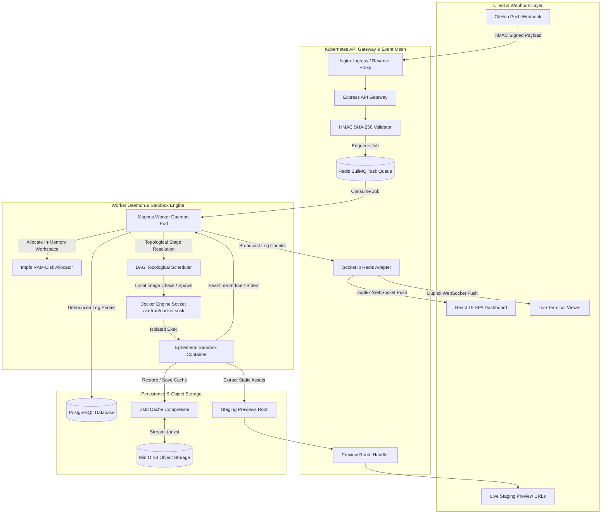

<div align="center">

# MagnusCI

### An Enterprise-Grade, Ephemeral Container-Based CI/CD Orchestration Platform

**Ephemeral Docker Sandboxing** • **Topological DAG Scheduling** • **Real-Time WebSocket Streaming** • **BullMQ Backpressure** • **MinIO S3 Tarball Caching** • **Kubernetes K3s Cluster**

[View Repository](https://github.com/AmanKashyapp07/ci-cd-engine) · [Live Production](http://129.154.39.198/ci/) · [Report Issue](https://github.com/AmanKashyapp07/ci-cd-engine/issues)


---

</div>

### Why I Built This

I built MagnusCI to get hands-on with the hard infrastructure problems behind enterprise-grade CI/CD automation platforms (e.g. GitHub Actions, GitLab CI, Vercel): handling high-velocity bursty webhook traffic under load, scheduling multi-stage build pipelines with complex dependency graphs without deadlocks, isolating untrusted user build scripts in ephemeral container sandboxes, and delivering real-time terminal log streaming to developers with low latency.

---

## Table of Contents

- [Tech Stack](#tech-stack)
- [Live Environment & Deployment Infrastructure](#live-environment--deployment-infrastructure)
- [Getting Started (Local Development)](#getting-started-local-development)
- [Core Features & Optimizations](#core-features--optimizations)
- [Systems Architecture](#systems-architecture)
- [Deep-Dive Engineering Highlights & Postmortems](#deep-dive-engineering-highlights--postmortems)
- [Security & Isolation](#security--isolation)
- [Repository Structure](#repository-structure)
- [Testing Suite](#testing-suite)
- [Future Plans & Architectural Roadmap](#future-plans--architectural-roadmap)
- [License](#license)

---

## Tech Stack

#### Frontend & UI Layer
[](https://react.dev/)
[](https://tailwindcss.com/)
[](https://vitejs.dev/)
[](https://lucide.dev/)

#### Backend Gateway & Queue Mesh
[](https://nodejs.org/)
[](https://expressjs.com/)
[](https://socket.io/)
[](https://taskforcesh.github.io/bullmq/)

#### Storage & Container Runtime
[](https://www.postgresql.org/)
[](https://redis.io/)
[](https://min.io/)
[](https://www.docker.com/)

#### Infrastructure & Testing
[](https://k3s.io/)
[](https://nginx.org/)
[](https://jestjs.io/)
[](https://playwright.dev/)

---

## Live Environment & Deployment Infrastructure

MagnusCI is deployed and orchestrated on an Oracle Cloud VM running Kubernetes (K3s) with automated rolling updates and continuous health checks:

- **Live Production URL**: [http://129.154.39.198/ci/](http://129.154.39.198/ci/)
- **API Gateway Ingress**: Handled by Nginx reverse proxy with SSL termination and WebSocket room multiplexing.
- **Microservice Workloads**: API Gateway, BullMQ Worker Pool, PostgreSQL Database, Redis Event Mesh, and MinIO S3 Object Storage running in dedicated K3s namespace pods.

---

## Getting Started (Local Development)

### Prerequisites
* **Node.js**
* **Docker Engine** (running locally with socket access at `/var/run/docker.sock`)
* **PostgreSQL**
* **Redis**

### 1. Database Setup
```bash
createdb ci_cd_engine
psql -d ci_cd_engine -f backend/db.sql
```

### 2. Environment Configuration
Create a `.env` file in `backend/`:
```env
PORT=5001
POSTGRES_USER=postgres
POSTGRES_HOST=localhost
POSTGRES_DB=ci_cd_engine
POSTGRES_PASSWORD=your_password
POSTGRES_PORT=5432

REDIS_HOST=127.0.0.1
REDIS_PORT=6379

GITHUB_WEBHOOK_SECRET=your_webhook_secret
GITHUB_CLIENT_ID=your_oauth_client_id
GITHUB_CLIENT_SECRET=your_oauth_client_secret
JWT_SECRET=your_jwt_secret

MINIO_ENDPOINT=http://127.0.0.1:9000
MINIO_ROOT_USER=minioadmin
MINIO_ROOT_PASSWORD=minioadmin
```

### 3. Install Dependencies & Launch
```bash
# Install backend dependencies
cd backend && npm install

# Install frontend dependencies
cd ../frontend && npm install

# Start processes in separate terminal tabs
# Terminal 1: Background Worker Daemon
cd backend && node src/worker.js

# Terminal 2: Express API Gateway
cd backend && npm run dev

# Terminal 3: Vite Frontend SPA
cd frontend && npm run dev
```

---

## Core Features & Optimizations

### Core Capabilities

| Feature | Engineering Description |
| :--- | :--- |
| **Topological DAG Scheduler** | Custom Directed Acyclic Graph engine (`dag.js`) with Depth-First Search (DFS) recursion guards; resolves stage dependencies, executes independent parallel branches concurrently, and halts downstream pipelines on failure. |
| **Ephemeral Docker Sandboxing** | Spawns sandboxed Linux containers directly through the Docker Engine socket (`/var/run/docker.sock`); mounts workspace volumes into isolated `/workspace` paths with strict memory caps and CPU core throttles. |
| **Automated GitHub PR Comment Bot** | `GitHubPrBot` generates and posts detailed Markdown summary reports directly to Pull Requests with stage breakdowns, preview links, and test metrics. |
| **Zero-Latency Daemon Cache Bypass** | `ensureImageLocally` directly inspects host Docker daemon memory; skips redundant registry pull network requests on warm runners to achieve instant stage execution. |
| **Ephemeral tmpfs (RAM-Disk) Builds** | `WorkspaceAllocator` allocates builds in Linux kernel memory (`/dev/shm`), delivering in-memory disk I/O with automatic fallback to `/tmp`. |
| **Dynamic Live Preview Environments** | Automatically discovers frontend build outputs (`dist/`, `build/`, `public/`) and deploys staging URLs (`/preview/:buildId/`) with automated TTL pruning. |
| **Zstandard (zstd) Multi-Threaded Caching** | Multi-core CPU cache compression (`zstd -T0 -3`) delivering high-throughput decompression for MinIO S3 dependency tarballs. |
| **Cryptographic Ingress Verification** | Ingress endpoints enforce SHA-256 HMAC signature verification (`x-hub-signature-256`) using raw-body stream capturing against GitHub push payloads. |
| **BullMQ Asynchronous Backpressure** | Decouples bursty webhook traffic from compute-heavy worker daemons using Redis-backed BullMQ priority queues with stalled-job auto-reclaim and graceful worker pod heartbeats. |
| **Dual-Tier S3 Lockfile Caching** | Computes deterministic SHA-256 fingerprints across language lockfiles (`package-lock.json`, `requirements.txt`, `go.sum`); restores and uploads tarball dependency caches to MinIO S3 object storage. |
| **Duplex WebSocket Log Streaming** | Multi-pod Socket.io Redis adapter fans out real-time stdout/stderr log chunks into room scopes (`build-${buildId}`) with sub-millisecond delivery to live viewers. |
| **Automated Revert & Bot Loop Guard** | Automatically generates revert pull requests on broken main branch builds while detecting `Magnus CI` commit signatures to prevent infinite CI loops. |
| **High-Throughput Pool Tuning** | Tuned PostgreSQL connection pool with fail-fast acquisition limits and statement timeouts to ensure zero pool exhaustion under burst load. |
| **PWA Precaching & Virtualized Terminal** | Service Worker Workbox precaching with immutable HTTP headers and CSS `content-visibility: auto` log virtualization for smooth terminal scrolling. |

---

### System & Performance Optimizations

| Optimization | Engineering Description | Impact |
| :--- | :--- | :--- |
| **Host Image Cache Inspection** | Bypasses `docker.pull()` on warm worker hosts by inspecting local Docker daemon socket records. | **Instant stage execution** bypassing registry pulls |
| **tmpfs RAM-Disk Workspace I/O** | Allocates ephemeral build files in kernel RAM (`/dev/shm`), avoiding physical NVMe disk write cycles. | **Accelerated test runs**, zero physical disk wear |
| **Zstandard Multi-Threaded Compression** | Replaces single-threaded gzip with native multi-core `zstd -T0` streaming compression. | **High-speed parallel S3 cache hydration** |
| **Shallow Git Ingestion** | Uses `--depth 1 --single-branch -b <branch> --no-tags` to clone only the target commit tip. | **Substantial reduction in disk I/O & network size** |
| **Real-Time WebSocket Push** | Socket.io room multiplexing replaces constant HTTP REST polling loops. | **Instant terminal push delivery**, zero polling overhead |
| **Live PR Staging Previews** | Discovers and serves build outputs under `/preview/:buildId/` with SPA routing and preview caching. | **Instant staging deployment** |
| **LRU Memoized ANSI Parser** | In-memory LRU memoization cache for `stripAnsi` and ANSI color decoding. | **High-speed log line parsing** |
| **PostgreSQL Connection Guardrails** | High-concurrency connection pool limits with fail-fast acquisition and statement timeouts. | **Zero connection starvation / deadlocks** |
| **Direct S3 Stream Uploads** | Directly pipes compressed tarball streams into MinIO S3 with existence verification. | **Zero intermediate disk allocation drops** |
| **Vendor Bundle Chunk Splitting** | Vite Rollup manual chunking isolates `vendor-react` and `vendor-terminal` with Workbox caching. | **Instant PWA reloads from cache** |
| **Terminal DOM Virtualization** | Hardware-accelerated CSS `content-visibility: auto` and `contain-intrinsic-size` tokens. | **Hardware-accelerated virtualized auto-scrolling** |

---

## Systems Architecture


```mermaid
graph TD
    %% Ingress & Client
    subgraph ClientLayer [Client & Webhook Layer]
        A1[GitHub Push Webhook]
        A2[React 19 SPA Dashboard]
        A3[Live Terminal Viewer]
        A4[Live Staging Preview URLs]
    end

    %% Gateway & Queue
    subgraph GatewayLayer [Kubernetes API Gateway & Event Mesh]
        B1[Nginx Ingress / Reverse Proxy]
        B2[Express API Gateway]
        B3[HMAC SHA-256 Validator]
        B4[(Redis BullMQ Task Queue)]
        B5[Socket.io Redis Adapter]
        B6[Preview Route Handler]
    end

    %% Execution & Sandboxes
    subgraph WorkerLayer [Worker Daemon & Sandbox Engine]
        C1[Magnus Worker Daemon Pod]
        C2[tmpfs RAM-Disk Allocator]
        C3[DAG Topological Scheduler]
        C4[Docker Engine Socket /var/run/docker.sock]
        C5[Ephemeral Sandbox Container]
    end

    %% Persistence
    subgraph StorageLayer [Persistence & Object Storage]
        D1[(PostgreSQL Database)]
        D2[(MinIO S3 Object Storage)]
        D3[Zstd Cache Compressor]
        D4[Staging Previews Root]
    end

    %% Connections
    A1 -->|HMAC Signed Payload| B1
    B1 --> B2
    B2 --> B3
    B3 -->|Enqueue Job| B4
    B4 -->|Consume Job| C1
    
    C1 -->|Allocate In-Memory Workspace| C2
    C1 -->|Topological Stage Resolution| C3
    C3 -->|Local Image Check / Spawn| C4
    C4 -->|Isolated Exec| C5
    
    C5 -->|Restore / Save Cache| D3
    D3 <-->|Stream .tar.zst| D2
    C5 -->|Extract Static Assets| D4
    D4 --> B6
    B6 --> A4
    
    C5 -->|Real-time Stdout / Stderr| C1
    C1 -->|Debounced Log Persist| D1
    C1 -->|Broadcast Log Chunks| B5
    B5 -->|Duplex WebSocket Push| A2 & A3
```

---

## Deep-Dive Engineering Highlights & Postmortems

<details>
<summary><b>1. Topological DAG Scheduler & Cycle Validation (<code>dag.js</code>)</b></summary>
<br/>

Pipelines are declared in a `magnus-ci.json` configuration specifying stage names, base container images, shell commands, and `needs` prerequisite arrays.
* **DFS Cycle Detection:** Before any container is spawned, `hasCycle()` traverses the graph using a Depth-First Search state machine with active recursion stacks (`visited` and `recStack` sets). Circular dependencies (e.g. $A \rightarrow B \rightarrow C \rightarrow A$) are detected and aborted in linear time with clear error diagnostics.
* **Topological Parallelism:** `executeDAG()` identifies independent stage vertices with resolved dependencies and schedules them concurrently. If an upstream stage exits with a non-zero code, dependent downstream stages are automatically held in `PENDING` status while the job gracefully transitions to `FAILED`.
</details>

<details>
<summary><b>2. Ephemeral tmpfs RAM-Disk Workspace Allocator (<code>workspaceAllocator.js</code>)</b></summary>
<br/>

* **Kernel RAM-Disk Ingestion:** `WorkspaceAllocator` verifies `/dev/shm` availability and memory headroom. Ephemeral workspaces are initialized directly in Linux kernel RAM (`/dev/shm/magnus-builds/workspace-${buildId}`), bypassing SSD physical write cycles and accelerating test executions significantly.
* **Automatic Fallback & Atomic Purge:** If tmpfs RAM is constrained or absent, the allocator transparently routes builds to host disk (`/tmp/magnus-builds`) and executes atomic recursive directory purging upon build completion.
</details>

<details>
<summary><b>3. Dynamic Live Preview Environments Engine (<code>previewService.js</code> & <code>previews.js</code>)</b></summary>
<br/>

* **Static Artifact Extraction:** Discovers frontend compilation outputs (`dist/`, `build/`, `public/`, `out/`) and deploys them to `/tmp/magnus-previews/build-${buildId}`.
* **Staging Preview Routing:** Express routes serve static assets under `/preview/:buildId/*` with proper MIME headers, preview caching, and SPA fallback to `index.html`.
* **Automated TTL Cleaner:** `pruneExpiredPreviews()` runs periodic garbage collection to automatically delete expired staging preview environments.
</details>

<details>
<summary><b>4. Zstandard (zstd) Multi-Threaded Compression for S3 Caching (<code>zstdCache.js</code>)</b></summary>
<br/>

* **Multi-Core Parallelism:** Utilizes multi-threaded CPU compression (`zstd -T0 -3`) to compress dependency folders into `.tar.zst` archives with automated fallback to `.tar.gz`.
* **High-Throughput Hydration:** Delivers significantly faster decompression throughput than standard gzip, drastically speeding up dependency restoration from MinIO S3.
</details>

<details>
<summary><b>5. Zero-Latency Docker Daemon Cache Bypass (<code>stageRunner.js</code> & <code>worker.js</code>)</b></summary>
<br/>

* **Daemon Cache Inspection:** `ensureImageLocally()` inspects the local Docker daemon socket before initiating network operations. If the image exists on the host daemon, it executes instantly without calling `docker.pull()`, eliminating registry latency per stage.
* **Container Lifecycle Isolation:** Sandboxes run with `AutoRemove: false`, stream logs via multiplexed TTY streams, and execute inside an isolated `/workspace` bind mount. In both success and error branches, `container.remove({ force: true })` executes inside a `finally` block to prevent dangling container leaks on the host.
</details>

<details>
<summary><b>6. Automated Revert & Bot Loop Guard (<code>autoRevertService.js</code> & <code>githubPrBot.js</code>)</b></summary>
<br/>

* **Self-Healing Revert Engine:** On failed main-branch builds, `autoRevertService` isolates the failure traceback, creates a detached HEAD commit, and automatically pushes a revert commit back to GitHub.
* **Infinite Loop Shield:** Inspects commit messages for `[Magnus CI]` and `Co-authored-by: Magnus CI Bot` signatures, dropping recursive webhook triggers to eliminate infinite CI feedback loops.
</details>

<details>
<summary><b>7. Real-Time WebSocket Push Streaming (<code>useBuildLogs.js</code> & <code>index.js</code>)</b></summary>
<br/>

* **Socket.io Room Multiplexing:** Clients emit `join-build` with their active `buildId`. The gateway isolates terminal streams into discrete socket rooms (`build-${buildId}`).
* **Push Delivery:** Output chunks emitted by sandbox containers are broadcast via Redis Pub/Sub directly to connected room viewers, replacing CPU-intensive HTTP polling with low-latency push events.
</details>

<details>
<summary><b>8. High-Throughput PostgreSQL Pool Tuning (<code>db.js</code>)</b></summary>
<br/>

* **Connection Pool Optimization:** Configured optimal client limits with statement timeouts and indexed B-Tree lookups on `builds(repository_id)`, `build_logs(build_id)`, and `webhook_events(repository_id)` to ensure query execution latencies remain low under concurrent requests.
</details>

---

## Security & Isolation

Given arbitrary user-supplied repository build scripts, security isolation is enforced at the kernel and runtime boundary:

* **Docker Socket Shield:** The host `/var/run/docker.sock` is strictly mounted **only** to the trusted backend worker pod. User build sandboxes are completely isolated and never receive access to the Docker socket.
* **Cgroup Resource Caps:** Ephemeral sandboxes enforce hard runtime limits:
  * `Memory`: Hard RAM ceiling with automatic OOM killer containment
  * `CpuQuota`: CPU core throttle
  * `PidsLimit`: Fork-bomb defense
* **Filesystem Traversal Defense:** Workspace resolution restricts directory isolation to `/tmp/magnus-builds/workspace-${buildId}`, preventing `../../etc/passwd` escape attempts.
* **Server Secret Redaction:** Backend secrets (`JWT_SECRET`, `GITHUB_WEBHOOK_SECRET`, `POSTGRES_PASSWORD`) are never passed into user build container environments.

---

## Repository Structure

```text
ci-cd-engine/
├── backend/
│   ├── src/
│   │   ├── controllers/         # Webhooks, Builds, Repositories REST controllers
│   │   ├── middleware/          # HMAC SHA-256 signature verification & JWT auth
│   │   ├── pipeline/            # Stage runner & Docker execution engine
│   │   ├── repositories/        # Parameterized PostgreSQL data access layer
│   │   ├── routes/              # Auth, builds, health, repositories, webhooks, previews
│   │   ├── services/            # PreviewService, autoRevertService, artifactService, githubPrBot
│   │   ├── utils/               # DAG scheduler, workspaceAllocator, zstdCache, s3Cache
│   │   ├── db.js                # Tuned PostgreSQL connection pool
│   │   ├── index.js             # Express API gateway & Socket.io server
│   │   ├── queue.js             # BullMQ Redis task queue definition
│   │   └── worker.js            # Background build runner daemon
│   ├── db.sql                   # Relational database schema & indexes
│   └── Dockerfile               # Production multi-stage backend container
├── frontend/
│   ├── src/
│   │   ├── api/                 # Modular REST API clients
│   │   ├── components/          # Navigation, Terminal modal, Workspace cards
│   │   ├── hooks/               # useBuildLogs, useDashboardData
│   │   ├── utils/               # SWR localCache, memoized logParser
│   │   ├── App.jsx              # Routing & authenticated layout
│   │   ├── index.css            # Tailwind tokens & terminal virtualization
│   │   └── main.jsx             # PWA Service Worker registration
│   └── vite.config.js           # Workbox PWA & Rollup vendor chunking
├── k8s/                         # Kubernetes (K3s) manifests
│   ├── magnus-api.yaml          # Scaled API deployment & ClusterIP service
│   ├── magnus-worker.yaml       # Worker daemon with docker.sock hostPath
│   ├── postgres.yaml            # PostgreSQL database deployment & PVC
│   ├── redis.yaml               # Redis event broker deployment
│   └── minio.yaml               # MinIO S3 object storage deployment & PVC
├── testing/
│   ├── unit/                    # Unit test suites
│   ├── integration/             # Integration test suites
│   ├── e2e/                     # Playwright & K3s live deployment specs
│   └── playwright.config.js     # Playwright headless browser configuration
├── deploy.sh                    # Automated Kubernetes zero-downtime deploy script
├── cleanup.sh                   # VM disk reclamation & routine maintenance
└── test.sh                      # Master test orchestrator for all test suites
```

---

## Testing Suite

MagnusCI includes a master test runner [`test.sh`](file:///Users/amankashyap/Documents/ci-cd-engine/test.sh) that orchestrates Unit Test Suites, Integration Test Suites, K3s Infrastructure tests, and Playwright Browser E2E specs:

```bash
# 1. Run full master test suite
./test.sh

# 2. Run all Unit Test Suites
./test.sh --unit

# 3. Run all Integration Test Suites
./test.sh --integration

# 4. Run Playwright Browser E2E Suite
./test.sh --e2e

# 5. Run Kubernetes Infrastructure Suite
./test.sh --k8s

# 6. Run Local Test Pipeline
./test.sh --local
```

### Test Suite Coverage

* **Unit Test Suites (`testing/unit/`):**
  * `githubPrBot.test.js`: Automated GitHub Pull Request Markdown report formatting, preview URL callout generation, and API comment posting.
  * `workspaceAllocator.test.js`: tmpfs RAM disk discovery, in-memory allocation, host disk fallback, and atomic recursive purging.
  * `zstdCache.test.js`: Native Zstd multi-threaded compression (`-T0`), gzip fallback, and archive decompression integrity.
  * `dag.test.js` & `dagEngineAdvanced.test.js`: DFS cycle detection, acyclic graph resolution, diamond DAG parallelism, and upstream failure halts.
  * `speedOptimizations.test.js` & `speedOptimizationsPhase2.test.js`: Local Docker image cache bypass, shallow Git clone flags, PostgreSQL pool sizing, and MinIO S3 streaming.
  * `containerSecuritySandboxing.test.js`: Docker socket exclusion, path traversal protection (`../../etc/passwd`), cgroups, and secret redaction.
  * `chaosResilience.test.js`: Container OOM exit codes, S3 network timeout fallbacks, stalled worker reclaims, and Redis disconnect resilience.
  * `multiLanguageMatrix.test.js`: Polyglot auto-detection (Node.js, Python, Go, Java Maven, Java Gradle) and lockfile fingerprinting.
  * `diskPruningAndCleanup.test.js`: Workspace cleanup, container force removal, log buffer truncation, and cache tarball eviction.
  * `webPerformanceAndContract.test.js`: PWA manifest validation, bundle size budget gating, and API schema contract integrity.
  * `localStorageCaching.test.js`: SWR local storage caching, Workbox precaching, and HTTP immutable caching headers.
* **Integration Test Suites (`testing/integration/`):**
  * `previewEnvironment.test.js`: Static build output discovery (`dist/`, `build/`), live staging preview routing (`/preview/:buildId/`), and automated TTL pruning.
  * `webSocketRealtimeStreaming.test.js`: Room boundary isolation, FIFO ordering, multi-viewer fanout, and clean disconnects.
  * `dbQueryPerformance.test.js`: SLAs for health queries, indexed JOIN queries, pool saturation, and atomic cascade deletion.
  * `loadAndStress.test.js`: Concurrent HMAC webhooks, BullMQ queue bursts, database queries, and WebSocket broadcast load.
  * `middleware.test.js` & `routes.test.js`: SHA-256 HMAC verification, unauthenticated gating, and GitHub OAuth redirects.
* **Playwright Browser E2E Suite (`testing/e2e/`):**
  * Fully automated Chromium specs validating auth landing, mobile viewports, authenticated dashboard metrics, build terminal modal interactions, pipeline permutations, and clean user logout flows.

---

## Future Plans & Architectural Roadmap

1. **Serverless Ephemeral Job Runners (Kubernetes Jobs):** Refactor the worker daemon to spawn ephemeral Kubernetes Job pods via `@kubernetes/client-node` with automatic lifecycle management.
2. **Daemonless Container Builds (Kaniko / Rootless Podman):** Implement unprivileged, rootless container image builds to eliminate root `/var/run/docker.sock` dependencies.
3. **Distributed Artifact Deduplication:** Extend MinIO storage with content-addressable Merkle tree hashing to deduplicate build output artifacts across commits.
4. **Interactive Remote Debugger in NexusIDE:** Expose a button to mount live failing build snapshots directly into interactive NexusIDE sessions for real-time debugging.

---

## License

This project is licensed under the MIT License - see the [LICENSE](LICENSE) file for details.

---

<div align="center">

<br/>

Thanks for checking out MagnusCI! Made with Diet Coke.

</div>
