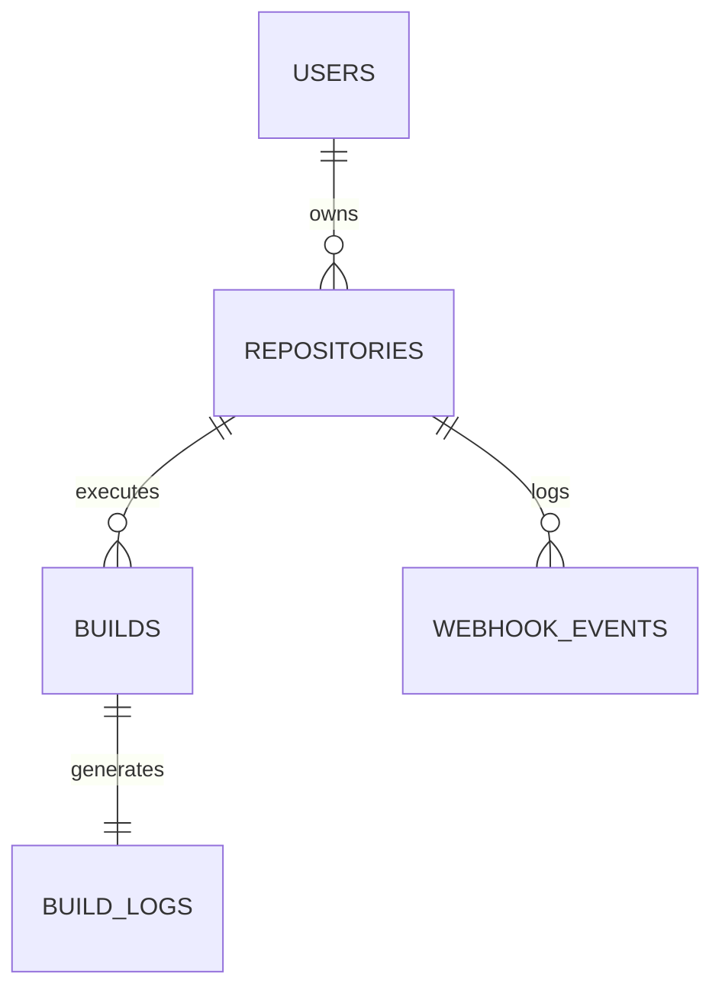

# MagnusCI: Relational Database Schema & Data Dictionary

*An in-depth reference of the relational database model, schemas, column dictionaries, indexes, and design patterns used in MagnusCI.*

---

## 🏛️ Entity-Relationship Diagram (ERD)

The following Mermaid diagram shows the logical relationships between entities in PostgreSQL.



---

## 1. Table-by-Table Data Dictionary

---

### A. `users` Table
Stores authenticated developer records generated during the GitHub OAuth2 handshake.

#### DDL Query
```sql
CREATE TABLE IF NOT EXISTS users (
    id SERIAL PRIMARY KEY,
    github_id VARCHAR(100) NOT NULL UNIQUE,
    username VARCHAR(255) NOT NULL,
    avatar_url TEXT,
    created_at TIMESTAMP DEFAULT CURRENT_TIMESTAMP
);
```

#### Columns
| Column Name | Data Type | Constraints | Architectural Meaning / Details |
| :--- | :--- | :--- | :--- |
| `id` | `SERIAL` | `PRIMARY KEY` | Auto-incrementing internal integer identifier. |
| `github_id` | `VARCHAR(100)` | `NOT NULL UNIQUE` | The immutable string ID returned by GitHub’s user API. Used as the unique key to match logins. |
| `username` | `VARCHAR(255)` | `NOT NULL` | The user's GitHub username handle (e.g. `amankashyap`). |
| `avatar_url` | `TEXT` | `NULL` | HTTP URL pointing to the user's GitHub profile avatar photo. |
| `created_at` | `TIMESTAMP` | `DEFAULT NOW()` | Record creation timestamp. |

---

### B. `repositories` Table
Stores registered repositories associated with users.

#### DDL Query
```sql
CREATE TABLE IF NOT EXISTS repositories (
    id SERIAL PRIMARY KEY,
    name VARCHAR(255) NOT NULL,
    github_url TEXT NOT NULL UNIQUE,
    user_id INT,
    created_at TIMESTAMP DEFAULT CURRENT_TIMESTAMP,
    FOREIGN KEY (user_id) REFERENCES users(id) ON DELETE CASCADE
);
```

#### Columns
| Column Name | Data Type | Constraints | Architectural Meaning / Details |
| :--- | :--- | :--- | :--- |
| `id` | `SERIAL` | `PRIMARY KEY` | Auto-incrementing internal identifier. |
| `name` | `VARCHAR(255)` | `NOT NULL` | The folder-name slug of the repository (e.g. `mock-repo`). |
| `github_url` | `TEXT` | `NOT NULL UNIQUE` | Normalized Git HTTPS URL. It is strictly forced to lowercase, stripped of spaces, trailing `.git` suffixes, and slashes before saving to ensure lookup matches. |
| `user_id` | `INT` | `FOREIGN KEY` (Nullable) | Links the repository to its owner in the `users` table. Nullable to support fallback hook ingestion cases. |
| `created_at` | `TIMESTAMP` | `DEFAULT NOW()` | Time of repo connection. |

---

### C. `builds` Table ⭐
Tracks individual build pipeline executions triggered by pushes or simulation calls.

#### DDL Query
```sql
CREATE TABLE IF NOT EXISTS builds (
    id SERIAL PRIMARY KEY,
    repository_id INT NOT NULL,
    commit_hash VARCHAR(100) NOT NULL,
    status VARCHAR(20) NOT NULL DEFAULT 'PENDING'
        CHECK (status IN ('PENDING', 'RUNNING', 'SUCCESS', 'FAILED')),
    created_at TIMESTAMP DEFAULT CURRENT_TIMESTAMP,
    started_at TIMESTAMP,
    finished_at TIMESTAMP,
    artifacts JSONB DEFAULT '[]'::jsonb,
    metrics JSONB DEFAULT '[]'::jsonb,
    FOREIGN KEY (repository_id) REFERENCES repositories(id) ON DELETE CASCADE
);
```

#### Columns
| Column Name | Data Type | Constraints | Architectural Meaning / Details |
| :--- | :--- | :--- | :--- |
| `id` | `SERIAL` | `PRIMARY KEY` | Auto-incrementing build execution trace number. |
| `repository_id` | `INT` | `NOT NULL`, `FOREIGN KEY` | Relational link to the repo. |
| `commit_hash` | `VARCHAR(100)` | `NOT NULL` | The SHA-1 hash of the specific git commit that triggered the build. |
| `status` | `VARCHAR(20)` | `DEFAULT 'PENDING'`, `CHECK` | Enforced state machine constraint. Values must strictly be: `PENDING`, `RUNNING`, `SUCCESS`, or `FAILED`. |
| `created_at` | `TIMESTAMP` | `DEFAULT NOW()` | Time build request enqueued in BullMQ. |
| `started_at` | `TIMESTAMP` | `NULL` | Time background worker dequeued job and started cloning. |
| `finished_at` | `TIMESTAMP` | `NULL` | Time build completed (success or failure). |
| `artifacts` | `JSONB` | `DEFAULT '[]'::jsonb` | Binary search tree JSON format containing arrays of harvested test coverage links and built binaries. |
| `metrics` | `JSONB` | `DEFAULT '[]'::jsonb` | Stores aggregate container telemetry stats (historical CPU% & Memory logs). |

---

### D. `build_logs` Table
Houses the stdout/stderr stream outputs generated inside Docker containers.

#### DDL Query
```sql
CREATE TABLE IF NOT EXISTS build_logs (
    id SERIAL PRIMARY KEY,
    build_id INT NOT NULL,
    log_message TEXT NOT NULL,
    created_at TIMESTAMP DEFAULT CURRENT_TIMESTAMP,
    FOREIGN KEY (build_id) REFERENCES builds(id) ON DELETE CASCADE
);
```

#### Columns
| Column Name | Data Type | Constraints | Architectural Meaning / Details |
| :--- | :--- | :--- | :--- |
| `id` | `SERIAL` | `PRIMARY KEY` | Auto-incrementing identifier. |
| `build_id` | `INT` | `NOT NULL UNIQUE`, `FOREIGN KEY` | Linked to target build trace record. |
| `log_message` | `TEXT` | `NOT NULL` | The complete, accumulated console logs generated by the compiler. |
| `created_at` | `TIMESTAMP` | `DEFAULT NOW()` | Save timestamp. |

---

### E. `webhook_events` Table
Logs raw payloads received from GitHub webhooks for audit logs and security audits.

#### DDL Query
```sql
CREATE TABLE IF NOT EXISTS webhook_events (
    id SERIAL PRIMARY KEY,
    repository_id INT,
    event_type VARCHAR(100) NOT NULL,
    payload JSONB NOT NULL,
    received_at TIMESTAMP DEFAULT CURRENT_TIMESTAMP,
    FOREIGN KEY (repository_id) REFERENCES repositories(id) ON DELETE SET NULL
);
```

#### Columns
| Column Name | Data Type | Constraints | Architectural Meaning / Details |
| :--- | :--- | :--- | :--- |
| `id` | `SERIAL` | `PRIMARY KEY` | Auto-incrementing logging id. |
| `repository_id` | `INT` | `FOREIGN KEY` (Nullable) | Associated repo. Nullable if event triggers a repo creation fallback. |
| `event_type` | `VARCHAR(100)` | `NOT NULL` | Type of event (e.g. `'push'`). |
| `payload` | `JSONB` | `NOT NULL` | Full raw JSON body parsed from the GitHub request. |
| `received_at` | `TIMESTAMP` | `DEFAULT NOW()` | Ingestion timestamp. |

---

## 2. Key Relational Design Patterns

---

### Cascading Deletes (`ON DELETE CASCADE`)
- **Implemented on**: `repositories.user_id` and `builds.repository_id` and `build_logs.build_id`.
- **Architectural Meaning**: If a user registers repositories, runs 50 builds, and later decides to delete their repository from the platform, PostgreSQL will automatically search for and delete all corresponding records in `builds` and `build_logs` within a single database transaction. 
- **Value**: Prevents "orphaned records" (garbage data referencing non-existent repositories) and ensures database consistency.

---

### Detached Event Retention (`ON DELETE SET NULL`)
- **Implemented on**: `webhook_events.repository_id`.
- **Architectural Meaning**: If a repository is deleted, the log histories of incoming webhooks inside `webhook_events` are **not** deleted. Instead, the `repository_id` column is set to `NULL`.
- **Value**: Preserves the audit trail. Even if a user removes a repository, the raw webhook payload logs remain in the system for security forensics to audit what IP/user triggered action histories.

---

### JSONB columns (`artifacts`, `metrics`, `payload`)
- **Implemented on**: `builds.artifacts`, `builds.metrics`, `webhook_events.payload`.
- **Why JSONB over JSON**:
  - `JSON` stores data as raw text, which must be re-parsed by the database engine on every read.
  - `JSONB` (JSON Binary) parses the payload into a decomposed binary format on write, making lookups, indexing, and partial updates much faster.
- **Value**: Allows MagnusCI to store flexible structure formats (like variable metrics dimensions or complex list arrays of harvested files) without altering the schema or needing a separate NoSQL database.

---

## 3. Optimization Indexes

To ensure high-performance query execution times even as builds scale, the database defines the following indexes:

```sql
CREATE INDEX IF NOT EXISTS idx_users_github_id ON users(github_id);
CREATE INDEX IF NOT EXISTS idx_repositories_user_id ON repositories(user_id);
CREATE INDEX IF NOT EXISTS idx_builds_repository_id ON builds(repository_id);
CREATE INDEX IF NOT EXISTS idx_builds_status ON builds(status);
CREATE INDEX IF NOT EXISTS idx_build_logs_build_id ON build_logs(build_id);
CREATE INDEX IF NOT EXISTS idx_webhook_repository_id ON webhook_events(repository_id);
```

### Why these indexes matter:
1. **`idx_users_github_id`**: Speeds up OAuth callback resolution. When a user logs in, we lookup their record using their GitHub profile ID string. This index ensures an $O(1)$ lookup instead of a full table scan.
2. **`idx_repositories_user_id`**: Speeds up dashboard load. When a logged-in user opens the page, we query: `SELECT * FROM repositories WHERE user_id = $1`. This index satisfies the lookup in microseconds.
3. **`idx_builds_repository_id` & `idx_builds_status`**: Optimizes the build history grid. Allows users to quickly filter builds for a specific repository or status (e.g. finding only `FAILED` builds).
4. **`idx_build_logs_build_id`**: Speeds up modal log loading. When the developer opens the BuildModal, the query `SELECT log_message FROM build_logs WHERE build_id = $1` runs. Since this index exists, it instantly loads the logs.

---

## 4. Systems Interview Talking Points

If the interviewer asks about database systems design, speak to these points:

* **Separation of High-Volume Text Fields**: *"I specifically isolated the `log_message` in a separate `build_logs` table instead of putting a TEXT column directly in the `builds` table. Because build logs can be massive, keeping them in `builds` would bloat the index pages and slow down common select queries. This separation ensures the query for the repository build history list remains thin and fast."*
* **JSONB for Dynamic Metrics**: *"I used PostgreSQL's binary JSON format (`JSONB`) to store container telemetry metrics and file artifact arrays. Telemetry metrics (CPU and Memory usage) can be dynamic, so storing them as binary JSON objects allowed me to write unstructured datasets without sacrificing parsing performance on read."*
* **Cascading Transactions**: *"By utilizing PostgreSQL's native schema constraints like `ON DELETE CASCADE` and check constraints, I shifted the burden of referential data sanity from the Node.js application layer to the database kernel layer. This guarantees data consistency even during crashes."*
* **Index-Driven Reads**: *"I indexed every foreign key relation and status column. In production pipelines, scanning table entries sequentially leads to thread blocking. The indexes ensure that finding the last 10 builds or loading logs for an active runner takes sub-millisecond query time."*
