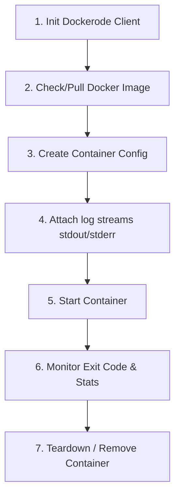

# Docker Integration & Communication Flow

This document details exactly how the MagnusCI backend worker communicates programmatically with the host's Docker Engine. 

---

## 1. The Communication Channel: Unix Sockets (`/var/run/docker.sock`)

Unlike basic scripts that invoke the command-line CLI (`docker run ...`), MagnusCI communicates directly with the Docker Engine daemon over a Unix domain socket.

```
+------------------------+                     +-----------------------+
|  MagnusCI Worker       |                     |  Docker Daemon        |
|  (Node.js / Dockerode) | ---> Unix Socket -> |  (dockerd Engine)     |
|                        |  /var/run/docker.sock |                       |
+------------------------+                     +-----------------------+
```

### The Code Endpoint
In Node.js, we instantiate `dockerode` which defaults to connecting via the Unix socket path:
```javascript
const Docker = require('dockerode');
const docker = new Docker({ socketPath: '/var/run/docker.sock' });
```
This allows Node to send HTTP API requests directly to dockerd (e.g. `/containers/create`, `/containers/json`) without spawning expensive shell processes.

---

## 2. Step-by-Step Container Lifecycle Flow

Here is the exact lifecycle of how a single DAG build stage (like `test`) is orchestrated from the Node.js daemon:



### Step 1: Pulling the Image
Before spawning, the worker checks if the base image (e.g. `node:20-alpine`) exists locally. If not, it triggers an HTTP stream request to the Docker Registry to download the image layers:
```javascript
await docker.pull(imageName);
```

### Step 2: Creating the Container
The container is configured with constraints to isolate the execution and preserve host system security:
```javascript
const container = await docker.createContainer({
  Image: imageName,
  Cmd: ['/bin/sh', '-c', runCommand],
  WorkingDir: '/app',
  HostConfig: {
    Binds: [`${workspacePath}:/app`], // Bind mount source code workspace
    Memory: 1024 * 1024 * 512,        // Limit to 512MB RAM
    CpuQuota: 50000,                  // Limit to 50% of 1 CPU core
    CpuPeriod: 100000
  }
});
```

### Step 3: Attaching to Stdout/Stderr Streams
To show the user live logs, the worker attaches to the container's output stream *before* starting it. This captures standard output (`stdout`) and error output (`stderr`) chunks:
```javascript
const stream = await container.attach({
  stream: true,
  stdout: true,
  stderr: true
});
stream.on('data', (chunk) => {
  // Push chunk data to PostgreSQL and emit via WebSockets
});
```

### Step 4: Starting and Waiting for Exit Code
The worker starts the container, then waits synchronously for the container to finish execution:
```javascript
await container.start();
const waitResult = await container.wait(); // Blocks until container stops
const exitCode = waitResult.StatusCode;     // Exit Code 0 = Pass, 1 = Fail
```

### Step 5: Telemetry Harvesting (CPU / Memory Stats)
While the container is running, a background daemon queries the container's metrics endpoint (`/containers/{id}/stats?stream=false`) every 2 seconds.
* **Memory:** Calculated by subtracting cache usage from active memory.
* **CPU:** Calculated using a delta of the container's total CPU usage relative to the system's global CPU ticks over the same interval.
* **Database Save:** These telemetry stats are written to PostgreSQL so the React frontend can plot them on Recharts.

### Step 6: Forced Teardown
Once the exit code is captured and logs are closed, the worker purges the container so it doesn't leak storage space:
```javascript
await container.remove({ force: true });
```

---

## 3. Whiteboard Interview Points

If the interviewer grills you on this architecture, hit them with these advanced infrastructure concepts:

1. **Docker out of Docker (DooD):** 
   MagnusCI runs inside a Docker container itself in production. To control sibling containers, we bind-mount `/var/run/docker.sock` from the host system into our worker container. This allows the worker to spawn sibling containers at the host level, avoiding the nested performance degradation of "Docker-in-Docker" (DinD).
   
2. **Direct Socket streaming:**
   Explain that we don't dump logs to a file and read it later. We use Node Streams to pipe the socket stream chunk-by-chunk to the database, ensuring near $0$ log lag.

3. **Resource Guardrails:**
   Mention that setting `Memory` and `CpuQuota` in the `HostConfig` is mandatory in multi-tenant environments. Otherwise, a rogue developer's infinite loop (e.g. `while(true) {}`) could consume all host resources and crash the entire CI gateway.
