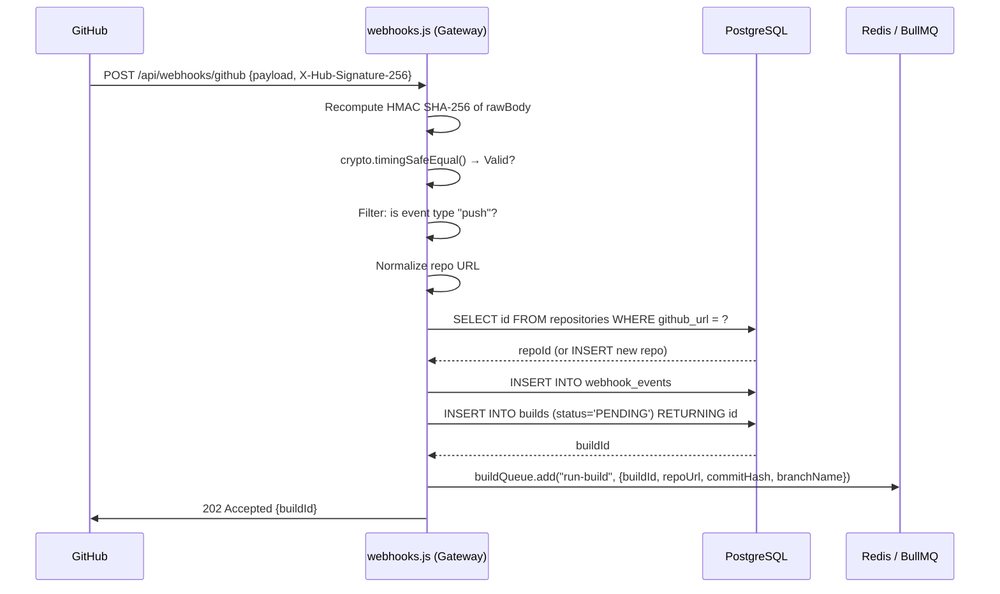
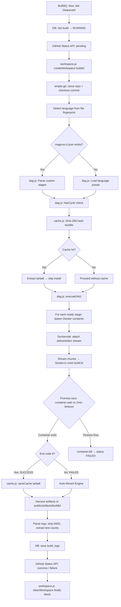
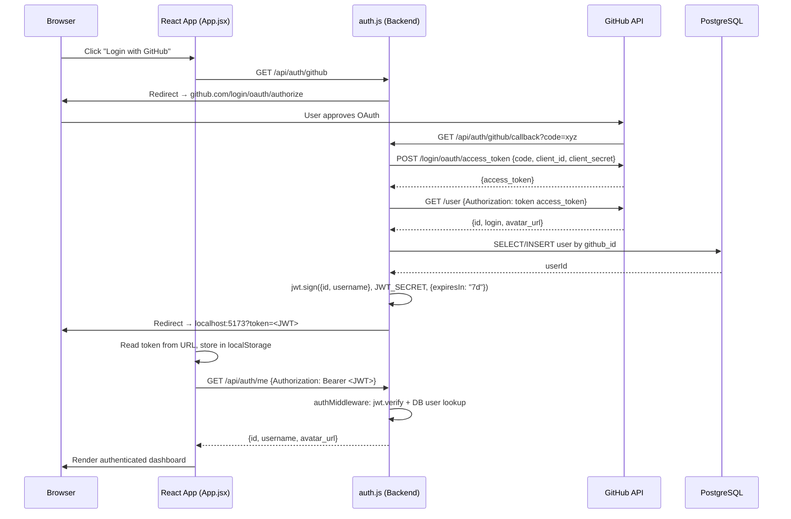
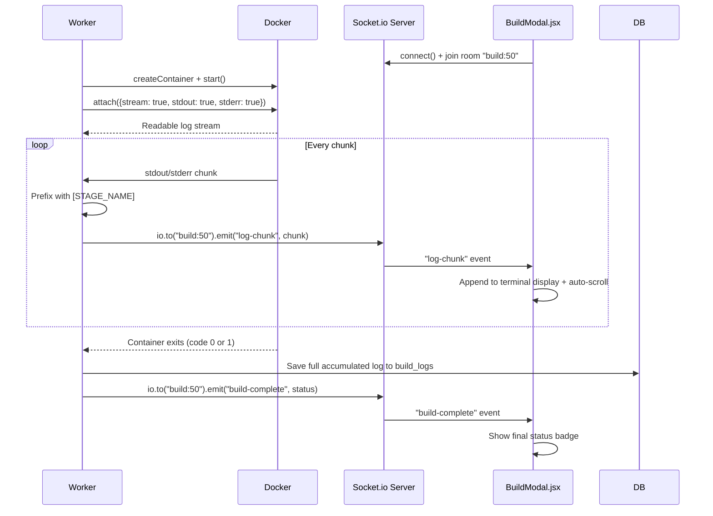

# MagnusCI: File Structure, Purpose & Information Flow

*Every file explained with what it contains, what it does, and how data moves through it. Based on the actual source code.*

---

## Complete Directory Tree

```
ci-cd-engine/
│
├── backend/                          ← Node.js Express Server + Worker Daemon
│   ├── .env                          ← Secret keys & environment config
│   ├── db.sql                        ← PostgreSQL schema (4 tables)
│   ├── package.json                  ← Backend dependencies
│   ├── caches/
│   │   └── tarballs/                 ← Compressed dependency archives (cache store)
│   ├── public/
│   │   └── artifacts/                ← Harvested test reports & binaries (served statically)
│   ├── temp_builds/                  ← Auto-created/destroyed per-build workspaces
│   │   └── {buildId}/               ← Isolated cloned repo for that build
│   └── src/
│       ├── index.js                  ← Express server entry point
│       ├── db.js                     ← PostgreSQL connection pool
│       ├── queue.js                  ← BullMQ queue instance
│       ├── worker.js                 ← Background job processor (biggest file ~1000 lines)
│       ├── workspace.js              ← Temp directory creator & destroyer
│       ├── middleware/
│       │   └── authMiddleware.js     ← JWT verification middleware
│       ├── routes/
│       │   ├── auth.js               ← GitHub OAuth + JWT generation
│       │   ├── repositories.js       ← CRUD for repositories
│       │   ├── builds.js             ← Fetch builds + logs
│       │   ├── webhooks.js           ← Webhook ingestion + signature verification
│       │   └── health.js             ← Simple health check
│       └── utils/
│           ├── dag.js                ← DAG parser, cycle checker, parallel executor
│           ├── cache.js              ← Lockfile hashing + tarball save/restore
│           └── githubStatus.js       ← GitHub Commit Status API caller
│
├── frontend/                         ← React SPA (Vite + Tailwind CSS v4)
│   ├── index.html                    ← HTML shell
│   ├── vite.config.js                ← Vite + Tailwind v4 configuration
│   ├── package.json                  ← Frontend dependencies
│   └── src/
│       ├── main.jsx                  ← React DOM entry point
│       ├── App.jsx                   ← Root component (all state lives here)
│       ├── index.css                 ← Global CSS reset
│       ├── components/
│       │   ├── Header.jsx            ← Top bar: logo, user avatar, connection status
│       │   ├── MetricsRow.jsx        ← Summary counters (repos, builds, success rate)
│       │   ├── MetricsChart.jsx      ← Live CPU + Memory container telemetry chart
│       │   ├── RepoList.jsx          ← Selectable sidebar list of registered repos
│       │   ├── BuildHistory.jsx      ← Build table grid with status badges
│       │   ├── BuildModal.jsx        ← Full-screen log viewer modal (TTY terminal)
│       │   └── ConnectRepoCard.jsx   ← Form to register a new repository
│       └── utils/
│           └── logParser.js          ← ANSI stripper + Jest/pytest/JUnit log parser
│
├── interview/                        ← Interview Preparation Materials
│   ├── presentation.md               ← 5-minute verbal speech script
│   └── technologies.md              ← Deep-dive on every technology used
│
├── reports/                          ← Architecture & learning documentation
│   └── *.md                          ← 16 reports (internals, DAG, caching, etc.)
│
├── README.md                         ← Full project documentation
└── deployment.md                     ← Production deployment guide (Nginx, PM2)
```

---

## Backend Files — Detailed Breakdown

---

### `backend/src/index.js` — Express Server Entry Point
**Size**: 50 lines | **Role**: Boots the web server, wires everything together.

**What it does**:
- Loads environment variables from `.env` via `dotenv`.
- Configures Express with CORS so the React frontend can make cross-origin requests.
- Sets up a custom JSON body parser that **preserves the raw request buffer** in `req.rawBody` — this is critical because the standard Express parser discards the original bytes after parsing, but the HMAC signature verifier needs the exact original bytes.
- Mounts all 5 route modules under `/api/*`.
- Serves the `public/artifacts/` folder as a static file directory (so harvested test reports and binaries are downloadable via URL).
- Starts the server on port `5001` and runs a DB health check query.

**Key code**:
```javascript
app.use(express.json({
  verify: (req, res, buf) => { req.rawBody = buf; }  // Preserve raw bytes for HMAC
}));
app.use('/artifacts', express.static(path.join(__dirname, '../public/artifacts')));
```

---

### `backend/src/db.js` — PostgreSQL Connection Pool
**Size**: 11 lines | **Role**: Singleton database connection pool.

**What it does**:
- Creates and exports a single `pg.Pool` instance connected to the `ci_cd_engine` PostgreSQL database.
- Every other file that needs to run a SQL query simply does `const pool = require('./db')` and calls `pool.query(...)`.
- A **connection pool** keeps a set of pre-opened database connections warm and ready. Reusing connections is far faster than opening a new TCP connection to PostgreSQL for every request.

---

### `backend/src/queue.js` — BullMQ Queue Instance
**Size**: 11 lines | **Role**: Singleton Redis-backed job queue.

**What it does**:
- Creates and exports a single **BullMQ `Queue`** instance named `'build-queue'`.
- Connects to Redis at `REDIS_HOST:REDIS_PORT` (defaults to `127.0.0.1:6379`).
- The gateway (`webhooks.js`) calls `buildQueue.add(...)` to push jobs.
- The worker (`worker.js`) creates a `Worker` against this same named queue to consume jobs.
- Because both files connect to the same queue name in Redis, jobs flow seamlessly from producer to consumer.

---

### `backend/src/workspace.js` — Ephemeral Directory Manager
**Size**: 26 lines | **Role**: Creates and destroys isolated build workspaces.

**What it does**:
- `createWorkspace(buildId)` → Creates `backend/temp_builds/{buildId}/` using `fs.mkdir`.
- `cleanWorkspace(buildId)` → Recursively deletes `backend/temp_builds/{buildId}/` using `fs.rm({ recursive: true, force: true })`.
- Called by `worker.js` at the **start** of every build (create) and in the `finally` block (clean), guaranteeing cleanup regardless of success, failure, or timeout.

---

### `backend/src/worker.js` — Background Job Processor ⭐
**Size**: ~1000 lines | **Role**: The brain of MagnusCI. Executes every build.

**What it does** (full lifecycle per job):
1. **Picks up job** from BullMQ queue (`buildId`, `repoUrl`, `commitHash`, `branchName`).
2. **Updates DB** → build status `PENDING` → `RUNNING`.
3. **Updates GitHub Status API** → marks commit as `pending`.
4. **Creates workspace** via `workspace.js`.
5. **Git clones** the repo into the workspace using `simple-git`, then checks out the specific `commitHash`.
6. **Detects language** by fingerprinting files (`package.json` → Node.js, `go.mod` → Go, etc.) or reads `magnus-ci.json`.
7. **Restores dependency cache** via `cache.js` (SHA-256 lockfile hash lookup).
8. **Loads DAG stages** via `dag.js`, checks for circular dependencies.
9. **For each stage**: Pulls the Docker image if missing → spawns container via Dockerode → attaches to stdout/stderr stream → prefixes logs with `[STAGE_NAME]` → streams to Socket.io → accumulates in buffer.
10. **Race condition timeout**: `Promise.race([container.wait(), 2-min timeout])`.
11. **After all stages**: Saves dependency cache tarball (on success only) via `cache.js`.
12. **Harvests artifacts**: Scans workspace for test coverage HTML and compiled binaries, copies them to `public/artifacts/{buildId}/`.
13. **Parses logs**: Strips ANSI codes, extracts test pass/fail counts using regex.
14. **On failure**: Triggers Auto-Revert Engine → generates git revert commit with diagnostic message → pushes to GitHub.
15. **Updates GitHub Status** → `success` or `failure`.
16. **Saves full logs** to `build_logs` table in PostgreSQL.
17. **Cleans workspace** via `workspace.js` in `finally` block.

---

### `backend/src/middleware/authMiddleware.js` — JWT Guard
**Size**: 30 lines | **Role**: Protects all non-public API routes.

**What it does**:
- Reads the `Authorization: Bearer <token>` header from the incoming request.
- Verifies the JWT signature using `jwt.verify()` with `JWT_SECRET`.
- Additionally **queries PostgreSQL** to confirm the user still exists (handles the case where a user was deleted after token was issued).
- Attaches the full user object to `req.user` so route handlers can access `req.user.id`.
- Used as middleware in `repositories.js`, `builds.js`, and `auth.js`.

---

### `backend/src/routes/webhooks.js` — Ingestion Gateway ⭐
**Size**: 138 lines | **Role**: Receives and validates GitHub webhook events.

**What it does** (in order):
1. `verifyGithubSignature` middleware: Reads `X-Hub-Signature-256` header. Recomputes HMAC SHA-256 of `req.rawBody` using `GITHUB_WEBHOOK_SECRET`. Compares with `crypto.timingSafeEqual()`.
2. Filters for `push` events only (ignores pull_request, issues, etc.).
3. **Infinite loop guard**: Checks if the push was made by `"Magnus CI"` (the auto-revert committer). If so, ignores it to prevent a loop.
4. Normalizes the repo URL (lowercase, strip `.git`, trim slashes).
5. Upserts the repository in the `repositories` table.
6. Logs the raw event to `webhook_events` table.
7. Creates a `PENDING` build record in `builds` table.
8. Pushes a job to BullMQ with `{ buildId, repoUrl, commitHash, branchName }`.
9. Returns `202 Accepted` immediately with the `buildId`.

---

### `backend/src/routes/auth.js` — GitHub OAuth Handler
**Size**: 107 lines | **Role**: Manages the full OAuth2 login flow.

**Routes**:
- `GET /api/auth/github` → Redirects browser to GitHub's OAuth authorization page.
- `GET /api/auth/github/callback` → Receives the `code` from GitHub, exchanges it for an `access_token`, fetches user profile, upserts user in PostgreSQL, signs a JWT (7-day expiry), redirects browser to `FRONTEND_URL?token=<jwt>`.
- `GET /api/auth/me` → (Protected) Returns the current logged-in user's profile.

---

### `backend/src/routes/repositories.js` — Repository CRUD
**Size**: 63 lines | **Role**: Manages repository registration per user.

**Routes**:
- `GET /api/repositories/` → Returns all repos owned by the authenticated user.
- `POST /api/repositories/` → Registers a new repo URL (normalizes it first) linked to `req.user.id`.
- `DELETE /api/repositories/:id` → Deletes a repo and cascades to its builds.

---

### `backend/src/routes/builds.js` — Build History & Logs
**Size**: 52 lines | **Role**: Serves historical build data to the dashboard.

**Routes**:
- `GET /api/builds/` → Returns all builds for the authenticated user's repos (JOINs `builds` + `repositories` tables).
- `GET /api/builds/:id/logs` → Returns full log text for a specific build from `build_logs` table. Verifies the build belongs to the authenticated user before returning.

---

### `backend/src/utils/dag.js` — DAG Pipeline Engine ⭐
**Size**: 203 lines | **Role**: Parses, validates, and executes the build pipeline graph.

**Three exported functions**:

1. **`loadPipelineStages(workspacePath, language, defaultImage)`**
   - Tries to read `magnus-ci.json` from the workspace root.
   - If found: parses the `stages` object into a normalized format.
   - If not found: looks up the language in `PRESETS` (hardcoded fallback commands per language).
   - If no preset: defaults to `npm test`.

2. **`hasCycle(stages)`**
   - Runs a Depth-First Search (DFS) on the stage dependency graph.
   - Uses a `visited` set and a `recStack` (recursion stack) to detect back-edges.
   - Returns `true` if a circular dependency exists (e.g., `A needs B, B needs A`).

3. **`executeDAG(stages, runStageFn)`**
   - Maintains a `states` map: each stage starts as `PENDING`.
   - In a loop: finds all stages whose `needs` are all `SUCCESS` → launches them in parallel as concurrent promises.
   - Waits using `Promise.race` on active promises when no new stages can be started yet.
   - If a stage fails, dependent stages that needed it remain `PENDING` and are never started.
   - Returns the final `states` map when all stages are either `SUCCESS` or `FAILED`.

---

### `backend/src/utils/cache.js` — Dependency Cache Manager
**Size**: 4926 bytes | **Role**: Lockfile hashing, tarball save & restore.

**What it does**:
- `restoreCache(workspacePath, language, repoId)`:
  - Detects the correct lockfile for the language (e.g., `package-lock.json` for Node.js).
  - Hashes the lockfile contents with `crypto.createHash('sha256')`.
  - Constructs cache key: `{repoId}-{language}-{hash}.tar.gz`.
  - If archive exists in `backend/caches/tarballs/`: extracts it into the workspace.
  - Returns `{ hit: true/false, cacheKey }`.
- `saveCache(workspacePath, language, cacheKey)`:
  - Compresses the dependency folder (e.g., `node_modules/`) into a tarball.
  - Saves it at `backend/caches/tarballs/{cacheKey}`.
  - Only called by `worker.js` when a build exits with code `0`.

---

### `backend/src/utils/githubStatus.js` — GitHub Status Updater
**Size**: 32 lines | **Role**: Posts commit status checks back to GitHub.

**What it does**:
- Single exported function: `updateGitHubStatus(owner, repo, sha, state, description, targetUrl)`.
- Makes a `POST` to `https://api.github.com/repos/{owner}/{repo}/statuses/{sha}`.
- `state` is one of `'pending'`, `'success'`, `'failure'`, `'error'`.
- Uses `GITHUB_TOKEN` for auth (Bearer token in header).
- Called by `worker.js` at build start (pending), build success, and build failure.

---

## Frontend Files — Detailed Breakdown

---

### `frontend/src/main.jsx` — React Entry Point
**Size**: 229 bytes | **Role**: Mounts the React app into the HTML DOM.

Renders `<App />` into the `#root` div in `index.html`. Standard Vite + React bootstrap.

---

### `frontend/src/App.jsx` — Root Component ⭐
**Size**: 38,693 bytes (~1000+ lines) | **Role**: All core state and logic lives here.

**What it manages**:
- **Auth state**: Reads the JWT from URL params on redirect, stores in localStorage, fetches user profile from `/api/auth/me`.
- **Repository list**: Fetches from `/api/repositories/`, allows selection of active repo.
- **Build history**: Fetches from `/api/builds/`, polls periodically for updates.
- **WebSocket connection**: Connects to the backend Socket.io server, subscribes to `build:{id}` rooms for live log streaming.
- **Container metrics**: Polls the backend for CPU/memory telemetry and passes to `MetricsChart`.
- Renders all child components, passing down state via props.

---

### `frontend/src/components/Header.jsx`
**Role**: Top navigation bar. Shows the MagnusCI logo, logged-in user avatar and username, and a live connection status indicator (WebSocket connected/disconnected).

---

### `frontend/src/components/MetricsRow.jsx`
**Role**: Displays 3 high-level summary cards: total registered repositories, total builds run, and overall success rate (%). Computed from the build history array.

---

### `frontend/src/components/MetricsChart.jsx`
**Size**: 9,721 bytes | **Role**: Renders a live line chart of active Docker container CPU% and memory usage.

Receives telemetry data from `App.jsx` (which polls the backend metrics endpoint). Uses a charting library to draw real-time lines that update as the container runs.

---

### `frontend/src/components/RepoList.jsx`
**Size**: 8,403 bytes | **Role**: Sidebar list of registered repositories. Clicking a repo sets it as the active selection, which filters the build history displayed in `BuildHistory.jsx`.

---

### `frontend/src/components/BuildHistory.jsx`
**Size**: 9,599 bytes | **Role**: Renders a table/grid of past builds for the selected repository.

Each row shows: build ID, commit hash (truncated), branch name, status badge (PENDING/RUNNING/SUCCESS/FAILED), duration, and a "View Logs" button that opens `BuildModal`.

---

### `frontend/src/components/BuildModal.jsx`
**Size**: 19,077 bytes | **Role**: Full-screen terminal-style log viewer modal.

**What it does**:
- When opened for a **completed** build: fetches logs from `GET /api/builds/:id/logs`.
- When opened for a **running** build: subscribes to the Socket.io `build:{id}` room and appends live log chunks as they stream in.
- Renders logs in a dark terminal-style container with monospace font and auto-scroll.
- "Download Logs" button: exports the raw log text as a `.txt` file.
- Also shows links to harvested artifacts (test coverage HTML, compiled binaries).

---

### `frontend/src/components/ConnectRepoCard.jsx`
**Size**: 4,457 bytes | **Role**: Input form to register a new GitHub repository.

Takes `name` and `github_url` as inputs, sends `POST /api/repositories/`, then refreshes the repo list. URL is displayed in normalized form after registration.

---

### `frontend/src/utils/logParser.js`
**Size**: 8,113 bytes | **Role**: Cleans raw Docker terminal output for browser display.

**Two main operations**:
1. **ANSI Strip**: Removes terminal color/formatting escape sequences (`\u001B[...m`) using regex so the browser doesn't display garbage characters.
2. **Test Summary Parsing**: Applies framework-specific regex rules to extract structured test results:
   - **Jest**: Matches `Tests: X passed, Y failed` pattern.
   - **pytest**: Matches `X passed, Y failed in Z.Zs` pattern.
   - **JUnit/Maven**: Matches `Tests run: X, Failures: Y` pattern.
   - Returns an object like `{ passed: 12, failed: 0, total: 12 }` used by `BuildModal` to display a summary badge.

---

## Information Flow Diagrams

### Flow 1: GitHub Push → Build Triggered



---

### Flow 2: Worker — Full Build Lifecycle



---

### Flow 3: User Login (GitHub OAuth)



---

### Flow 4: Live Log Streaming (Running Build)



---

### Flow 5: DAG Parallel Stage Execution

```mermaid
flowchart LR
    A[Load magnus-ci.json] --> B[Parse 4 stages]
    B --> C[hasCycle DFS check]
    C --> D{Cycle found?}
    D -- Yes --> E[Throw error: abort build]
    D -- No --> F[executeDAG loop starts]
    F --> G[setup: PENDING, no needs → READY]
    G --> H[Launch setup container]
    H --> I[setup: RUNNING]
    I --> J[setup: SUCCESS]
    J --> K[lint: needs setup ✓ → READY]
    J --> L[test: needs setup ✓ → READY]
    K --> M[Launch lint + test containers simultaneously]
    L --> M
    M --> N[lint: RUNNING]
    M --> O[test: RUNNING]
    N --> P[lint: SUCCESS]
    O --> Q[test: SUCCESS]
    P --> R{compile: needs lint ✓ and test ✓ → READY}
    Q --> R
    R --> S[Launch compile container]
    S --> T[compile: SUCCESS]
    T --> U[All stages done → return states map]
```



---

## Quick File Reference Card

| File | Lines | What to say in 1 sentence |
|---|---|---|
| `index.js` | 50 | Boots Express, mounts all routes, preserves `rawBody` for HMAC. |
| `db.js` | 11 | Singleton PostgreSQL connection pool shared across all files. |
| `queue.js` | 11 | Singleton BullMQ queue connected to Redis for job passing. |
| `worker.js` | ~1000 | Full build orchestrator — clones, caches, containers, streams, reverts, harvests. |
| `workspace.js` | 26 | Creates and destroys per-build temp directories. |
| `authMiddleware.js` | 30 | JWT verifier that also checks the user still exists in the DB. |
| `webhooks.js` | 138 | HMAC verifier + O(1) job enqueuer + infinite loop guard. |
| `auth.js` | 107 | Full GitHub OAuth2 flow → JWT issuance. |
| `repositories.js` | 63 | GET/POST/DELETE repos with URL normalization. |
| `builds.js` | 52 | Serves build history and log text to the frontend. |
| `dag.js` | 203 | Parses config, detects cycles (DFS), executes stages concurrently. |
| `cache.js` | ~120 | SHA-256 lockfile hashing, tarball save/restore. |
| `githubStatus.js` | 32 | One function: POST to GitHub Statuses API. |
| `App.jsx` | ~1000 | All frontend state: auth, repos, builds, WebSocket, metrics. |
| `BuildModal.jsx` | ~500 | Live terminal log viewer with Socket.io subscription. |
| `logParser.js` | ~200 | ANSI strip + framework-specific test result extraction. |
