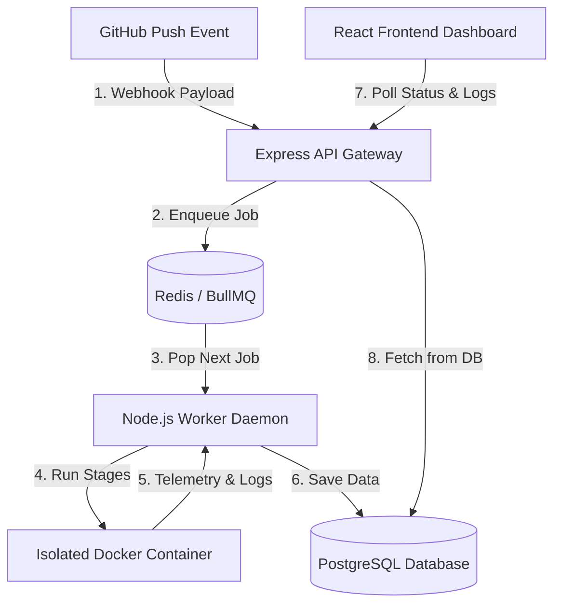

# MagnusCI: Frontend Architecture Guide 🎨

This guide outlines how the frontend React Single Page Application (SPA) integrates with the backend API to show real-time build updates, visualize server telemetry, and display color-coded terminal outputs.

---

## 🚀 1. The Frontend Tech Stack

The UI is built to look and feel like a modern DevOps platform (similar to Vercel or GitHub Actions). 

| Tech Choice | Purpose | Why We Chose It |
| :--- | :--- | :--- |
| **React 18 & Vite** | SPA Framework | Vite provides near-instant Hot Module Replacement (HMR) and extremely fast build times, while React's component model keeps the UI modular. |
| **Tailwind CSS v4** | Utility-First Styling | Allows custom dark-mode aesthetics (glassmorphism, subtle glowing indicators, responsive grids) without bulky CSS files or style conflicts. |
| **Recharts** | Interactive Telemetry Graphs | High-performance SVG graphing library. Used to plot CPU and Memory utilization data points fetched from active Docker runs. |
| **Lucide React** | Scalable Icons | Vector icons that cleanly integrate as React components and respond to Tailwind hover/focus classes. |

---

## 🧠 2. Detailed Hooks & React State Strategy

Rather than adding state libraries like Redux, MagnusCI uses built-in React hooks. This avoids unnecessary rendering overhead and ensures that data changes propagate through the virtual DOM efficiently.

---

### 1. `useState`: Component State Synchronization
* **Concept:** Used to trigger UI updates when data changes. When a state variable updates, React re-renders the component and its children with the new values.
* ** MagnusCI Implementation:** Used to manage user authentication state (`token`, `user`), lists of registered repositories (`repos`), current build queues (`builds`), and UI modals (`selectedBuild`, `selectedRepo`).
* **Senior Insight:** State is kept **unidirectional** and lifted to the root `App` component. Since children components like `RepoList` or `BuildHistory` only read and display this data via React props, they remain purely functional and fast.

---

### 2. `useEffect`: Lifecycle & Network Synchronization
* **Concept:** Allows you to synchronize a component with an external system (such as database polling or network APIs) based on state changes.
* **MagnusCI Implementation:** Used for two major tasks:
  1. Fetching user profile data and initial repositories list immediately after mounting.
  2. Setting up the short-polling timer. If a user selects a build, `useEffect` registers a `setInterval` to call the `/logs` API every 2 seconds.
* **Senior Insight (The Cleanup Phase):** To avoid massive memory leaks (multiple intervals running at once), the polling hook returns a **cleanup function** (`clearInterval(interval)`). Whenever the active build modal changes or closes, React runs this cleanup, immediately tearing down the active interval timer.

---

### 3. `useCallback`: Function Signature Memoization
* **Concept:** React components re-define all nested functions on every single render. If you pass a function down as a prop to a child component, the child will think the function has changed and re-render itself, causing a cascade of redundant renders. `useCallback` keeps the same function instance in memory.
* **MagnusCI Implementation:** Used to wrap UI notification hooks (like `showToast`). 
* **Senior Insight:** Because the dashboard polls the API Gateway every 2 seconds, the root component is constantly re-rendering. Wrapping helper methods in `useCallback` ensures that child components don't receive new function reference pointers, stopping redundant renders in their tracks.

---

### 4. `useRef`: Escaping the React Rendering Lifecycle
* **Concept:** Unlike `useState`, changing the value of a `useRef` object **does not trigger a component re-render**. It is used to hold a persistent mutable reference to a physical DOM node.
* **MagnusCI Implementation:** Linked to an empty `div` anchored at the bottom of the log viewer modal.
* **Senior Insight (Solving Performance Bottlenecks):** Streaming logs can result in thousands of text updates. If we tried to store the scroll position in a React state and update it on every log arrival, the UI would lock up. Instead, we use `useRef` to directly grab the DOM node and run standard HTML `scrollIntoView()` on every interval fetch. This completely bypasses React's virtual DOM diffing engine, maintaining a smooth 60 FPS experience.

---

## 📡 3. Connecting to the Backend: Polling vs. WebSockets

To keep the application data synchronized with ongoing builds, we use **Aggressive Short-Polling** (requesting status updates via HTTP requests every 2 seconds).

### Why Polling Was Chosen Over WebSockets:
```
                                 [ CONTEXT ]
                      CI/CD builds are short-lived.
                     Most builds complete in <2 mins.
                     
      +-----------------------------------+-----------------------------------+
      |      WebSockets (Persistent)      |       Short-Polling (REST)        |
      +-----------------------------------+-----------------------------------+
      | Consumes server memory for each   | Entirely stateless.               |
      | active user connection.           |                                   |
      |                                   |                                   |
      | Harder to scale horizontally.     | Easily distributed behind a load  |
      |                                   | balancer.                         |
      |                                   |                                   |
      | Overkill for short build runs.    | Simple, reliable, and performant. |
      +-----------------------------------+-----------------------------------+
```

---

## 📟 4. How Logs are Rendered (ANSI Parsing)

Docker output streams are raw text files that contain terminal formatting codes (like `\x1b[32m` for green text). If rendered directly, the browser displays garbage text.

1. **Fetch:** The React app requests logs from `GET /api/builds/:id/logs`.
2. **Intercept:** The app runs the raw text through a parser utility (`utils/logParser.js`).
3. **Regex Clean:** The parser identifies ANSI color codes.
4. **CSS Map:** The parser wraps the targeted text segment inside HTML `<span>` tags with specific Tailwind color classes (e.g. `text-emerald-400` for success markers, `text-red-500` for failure logs).
5. **Render:** The color-coded, readable text is painted in a simulated terminal box.

---

## 🗺️ 5. High-Level Communication Flowchart

Here is the path the data takes to get from a code commit to the user's dashboard:


